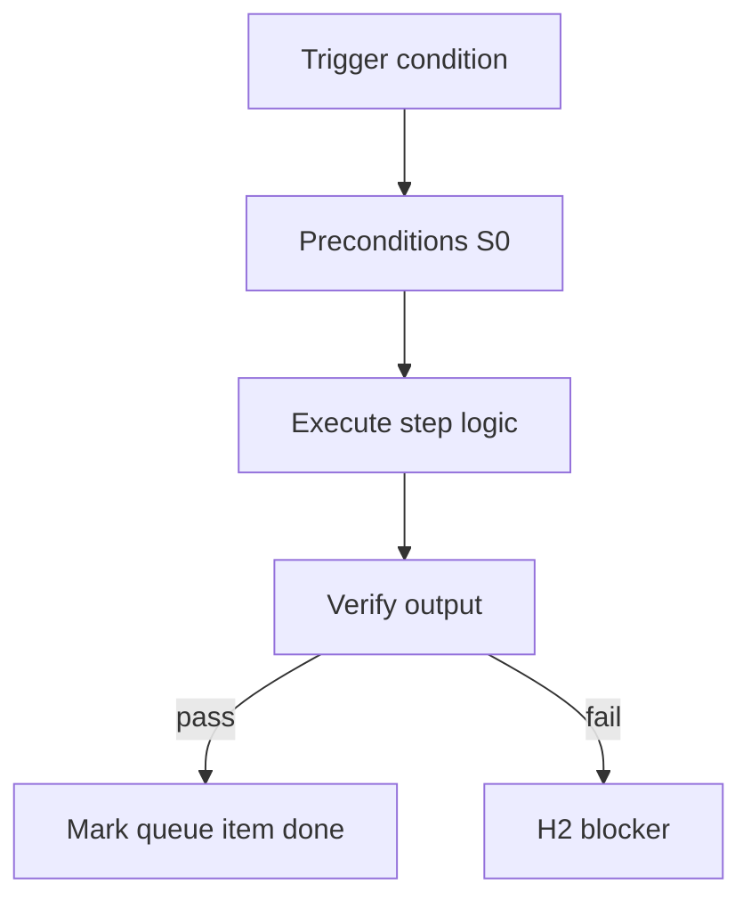

<!-- Complete pass 3 2026-06-28 INTRO-1.2 -->

# INTRO-1.2: Human touchpoint contract H1 H2 H3

**Parent:** [INTRO-1-index](INTRO-1-index.md) · **Branch INTRO** · **Vision §11** · **Release:** meta

## Reader narrative
<!-- prose-source: agent meta 2026-06-28 -->

The expert system recognizes exactly three human touchpoint classes. H1 is initial planning: the operator supplies a spec or company charter and receives an approved plan artifact—once per project, program, or pack instantiation. H2 is blocker assistance: triggered when preflight blocks, goal verification fails, or an external dependency is missing; the system pauses, notifies, and resumes when unblocked. H3 is final sign-off: triggered only after goal_verify passes; accept or reject with notes, where rejection re-enters pursuit.

Everything else—including HLD and DD review by default—becomes agent self-gate with evidence unless strict HITL mode is enabled. This contract is the social license for autopilot: operators know when they must act versus when they may read dashboards only.

## Purpose

INTRO-1.2 defines human touchpoint contract h1 h2 h3 for the agent-driven expert system. North star, scope, minimal HITL (H1/H2/H3).
## Scope

- Owns `INTRO-1.2` only; siblings under `INTRO-1` must not duplicate this spec.
- Aligns with minimal HITL: H1 plan, H2 blocker, H3 sign-off ([INTRO-1.2](INTRO-1.2-human-touchpoint-contract-h1-h2-h3.md)).
- Conflicts resolve in favor of [Vision §11 — Branch I — Runtime & integration plane](../../full-automation-vision-and-hierarchy.md#11-branch-i-runtime-integration-plane).

```
INTRO-1.2 human touchpoint contract h1 h2 h3
```
## Behavior / step logic
<!-- timeline-source: agent cli-composer-2.5 2026-06-28 -->

1. H2 is blocker assistance: triggered when preflight blocks, goal verification fails, or an external dependency is missing; the system pauses, notifies, and resumes when unblocked
2. This contract is the social license for autopilot: operators know when they must act versus when they may read dashboards only
3. At H1, the operator supplies a spec or charter; the approved plan reflects this summary—north star, scope, and minimal HITL (H1/H2/H3).
4. All pursuit and plane specs assume three structural shifts: always-on pursuit until goals verify, parallel product and self-improvement work, and template-packs at company scale.
5. When scope or stop behavior is ambiguous, agents resolve conflicts using this summary before inventing new policy.



## JSON example

```json
{
  "node": "INTRO-1.2",
  "description": "human touchpoint contract h1 h2 h3",
  "state": { "ref": "APP-B-state-json-sketch.md" },
  "implemented_in_release": "v2.14+"
}
```


## Repo artifacts (this branch)


## Edge cases

- Operator closes laptop mid-loop — state.json must resume from last good dual-write.
- Concurrent manual edit to queue JSON — conductor reloads queue each wake; last writer wins with journal note.
- Edge case `INTRO-1.2` variant 3: verify state dual-write before continuing pursuit.
- Edge case `INTRO-1.2` variant 4: verify state dual-write before continuing pursuit.
- Pass 3: add regression test or evidence path specific to `INTRO-1.2`.
- Pass 3: cross-link related nodes in same branch index.

## Failure modes

- **Silent stop:** Agent ends turn without updating queue → mitigated by /loop + check-hierarchy-queue.py EMPTY gate.
- **False complete:** Item marked done without artifact → audit-hierarchy-depth.py re-enqueues deepen pass.
- **Scope bleed:** Worker edits journal/state during planning-only expansion → forbidden in vision-expansion-prompt.
- **Stale design:** Upstream vision § changes → reconcile-stale adds deepen items for affected ids.

## Concrete implementation

1. Map `INTRO-1.2` to v2.14–v2.23 release row in SEC-15-index.md.
2. Create or extend S0 script if behavior is file-derived.
3. Add unit test under tests/unit/test_intro-1_2.py when script exists.
4. Validate `INTRO-1.2` against SEC-15 release checklist and parent index links.
5. Document `INTRO-1.2` in parent index with verify command and release tag.
6. Add checklist row in SEC-15 release doc for `INTRO-1.2`.

## Verification

| Check | Command |
|-------|---------|
| Completeness | `python scripts/automation/audit-hierarchy-depth.py --strict --ids INTRO-1.2` |
| Conformance | `python scripts/validate-workflow.py` |
| Task evidence | `python scripts/verify-router.py` when implement task exists |

## Dependencies

| Link | Why |
|------|-----|
| [full-automation-vision-and-hierarchy.md](../../full-automation-vision-and-hierarchy.md) §11 | Master hierarchy |
| [INTRO-1-index](INTRO-1-index.md) | Parent grouping |
| [genius-conductor-tiered-routing.md](../../genius-conductor-tiered-routing.md) | S0–S4 routing |

## Acceptance criteria

- [ ] `python scripts/automation/audit-hierarchy-depth.py --strict --ids INTRO-1.2` passes
- [ ] Named script, skill, or test path exists or is listed in SEC-15 release row
- [ ] Linked from [INTRO-1-index](INTRO-1-index.md)
- [ ] `python scripts/validate-workflow.py` passes after implement

## Cross-links

- [hierarchy-expander SKILL](../../../.cursor/skills/hierarchy-expander/SKILL.md)
