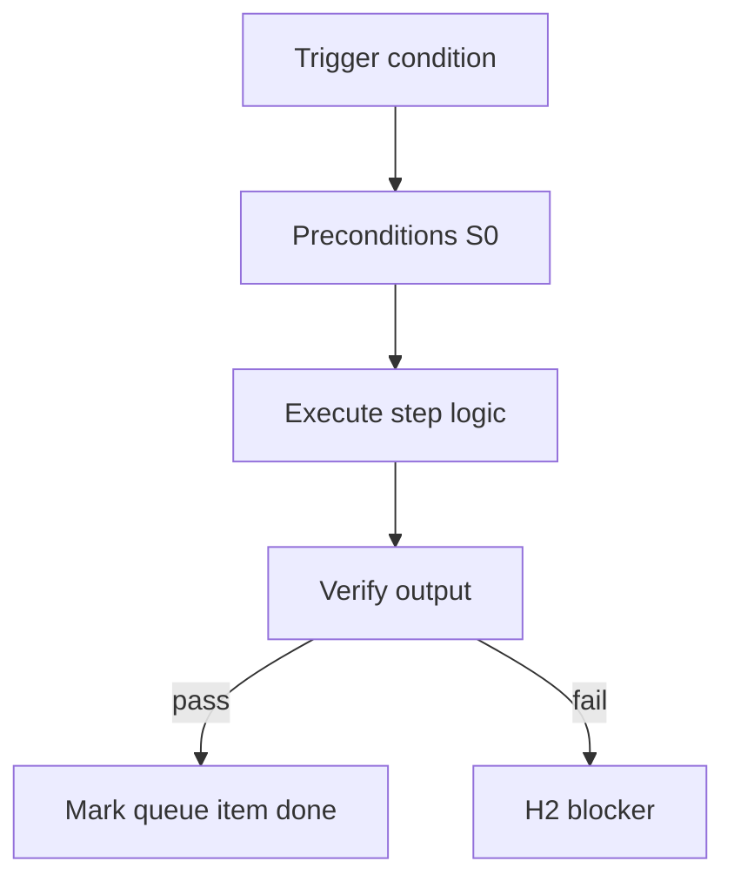

<!-- Complete pass 3 2026-06-28 INTRO-1.3 -->

# INTRO-1.3: Goal completion criterion

**Parent:** [INTRO-1-index](INTRO-1-index.md) · **Branch INTRO** · **Vision §11** · **Release:** v2.14

## Reader narrative
<!-- prose-source: agent meta 2026-06-28 -->

A goal is achieved only when five conditions hold together: acceptance artifacts exist, automated goal verification passes, staleness and integration graphs are consistent, no blocking questions remain without deferred rationale, and platform debt for the goal is promoted or explicitly waived with expiry.

The agent does not stop for status theater. It stops on H1, H2, H3, unrecoverable failure, or resource budget caps. This criterion prevents the common failure mode of marking tasks done while the overarching goal remains unproven—Plane G goal_verify exists to enforce this bar.

## Purpose

INTRO-1.3 defines goal completion criterion for the agent-driven expert system. North star, scope, minimal HITL (H1/H2/H3).
## Scope

- Owns `INTRO-1.3` only; siblings under `INTRO-1` must not duplicate this spec.
- Aligns with minimal HITL: H1 plan, H2 blocker, H3 sign-off ([INTRO-1.2](INTRO-1.2-human-touchpoint-contract-h1-h2-h3.md)).
- Conflicts resolve in favor of [Vision §11 — Branch I — Runtime & integration plane](../../full-automation-vision-and-hierarchy.md#11-branch-i-runtime-integration-plane).

```
INTRO-1.3 goal completion criterion
```
## Behavior / step logic
<!-- timeline-source: agent cli-composer-2.5 2026-06-28 -->

1. When [A2.1](A2.1-preflight-check-pipeline-blocked-extended.md) reports READY, the conductor reads next_action from state.json and invokes exactly one matching skill phase—implement-feature, dd-writer, or continue—never batching design, implement, and verify in a single wake.
2. Each wake produces one ledger entry, one evidence slot, and one dual-write boundary so pursuit audit trails stay aligned with a single next_action transition per [A2.7](A2.7-no-intermediate-wait-for-continue.md).
3. Economy workers run only when spawn_workers is true and [B2.2](B2.2-librarian-allowed-reads-catalog-composition.md) allowed_reads constrain scope; the conductor does not chain additional phases before post-step housekeeping.
4. When the skill phase completes, control passes to [A2.3](A2.3-post-step-route-tier-dual-write-increment.md) for route-tier, journal-keeper dual-write, and counter increment before the next preflight cycle.
5. Violating one-step semantics—or executing when preflight was BLOCKED—halts pursuit at H2 because partial state makes resume ambiguous after crash, laptop sleep, or operator interrupt.



## JSON example

```json
{
  "node": "INTRO-1.3",
  "description": "goal completion criterion",
  "state": { "ref": "APP-B-state-json-sketch.md" },
  "implemented_in_release": "v2.14+"
}
```


## Repo artifacts (this branch)


## Edge cases

- Operator closes laptop mid-loop — state.json must resume from last good dual-write.
- Concurrent manual edit to queue JSON — conductor reloads queue each wake; last writer wins with journal note.
- Edge case `INTRO-1.3` variant 3: verify state dual-write before continuing pursuit.
- Edge case `INTRO-1.3` variant 4: verify state dual-write before continuing pursuit.
- Pass 3: add regression test or evidence path specific to `INTRO-1.3`.
- Pass 3: cross-link related nodes in same branch index.

## Failure modes

- **Silent stop:** Agent ends turn without updating queue → mitigated by /loop + check-hierarchy-queue.py EMPTY gate.
- **False complete:** Item marked done without artifact → audit-hierarchy-depth.py re-enqueues deepen pass.
- **Scope bleed:** Worker edits journal/state during planning-only expansion → forbidden in vision-expansion-prompt.
- **Stale design:** Upstream vision § changes → reconcile-stale adds deepen items for affected ids.

## Concrete implementation

1. Map `INTRO-1.3` to v2.14–v2.23 release row in SEC-15-index.md.
2. Create or extend S0 script if behavior is file-derived.
3. Add unit test under tests/unit/test_intro-1_3.py when script exists.
4. Validate `INTRO-1.3` against SEC-15 release checklist and parent index links.
5. Document `INTRO-1.3` in parent index with verify command and release tag.
6. Add checklist row in SEC-15 release doc for `INTRO-1.3`.

## Verification

| Check | Command |
|-------|---------|
| Completeness | `python scripts/automation/audit-hierarchy-depth.py --strict --ids INTRO-1.3` |
| Conformance | `python scripts/validate-workflow.py` |
| Task evidence | `python scripts/verify-router.py` when implement task exists |

## Dependencies

| Link | Why |
|------|-----|
| [full-automation-vision-and-hierarchy.md](../../full-automation-vision-and-hierarchy.md) §11 | Master hierarchy |
| [INTRO-1-index](INTRO-1-index.md) | Parent grouping |
| [genius-conductor-tiered-routing.md](../../genius-conductor-tiered-routing.md) | S0–S4 routing |

## Acceptance criteria

- [ ] `python scripts/automation/audit-hierarchy-depth.py --strict --ids INTRO-1.3` passes
- [ ] Named script, skill, or test path exists or is listed in SEC-15 release row
- [ ] Linked from [INTRO-1-index](INTRO-1-index.md)
- [ ] `python scripts/validate-workflow.py` passes after implement

## Cross-links

- [hierarchy-expander SKILL](../../../.cursor/skills/hierarchy-expander/SKILL.md)
