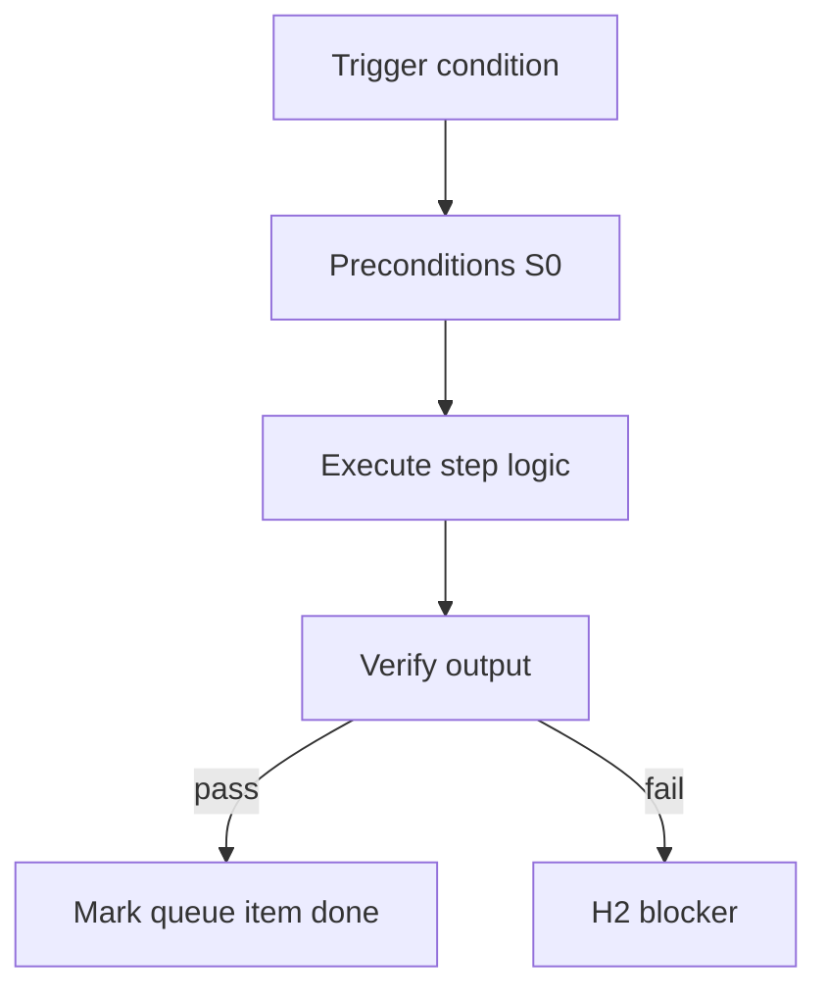

<!-- Complete pass 3 2026-06-28 MASTER-A -->

# MASTER-A: Branch A — Pursuit & control plane

**Parent:** — · **Branch MASTER** · **Vision §2** · **Release:** meta

## Reader narrative
<!-- prose-source: agent meta 2026-06-28 -->

Plane A is pursuit and control: the always-on loop that runs from approved intent until verification succeeds or a defined stop reason fires. It owns the goal model, preflight, one-step execution, post-step routing, goal-level verification handoff, and the semantics of Continue redefined for autonomy.

Every other plane feeds or constrains this loop—B routes execution, C performs product steps, G proves outcomes—but A is where "never stop until verified" lives. When reading A1–A6 capabilities, keep this chapter summary in mind as the architectural north star for that branch.

## Purpose

MASTER-A defines branch a   pursuit   control plane for the agent-driven expert system. Top-level decomposition into ten planes.
## Scope

- Owns `MASTER-A` only; siblings under `—` must not duplicate this spec.
- Aligns with minimal HITL: H1 plan, H2 blocker, H3 sign-off ([INTRO-1.2](INTRO-1.2-human-touchpoint-contract-h1-h2-h3.md)).
- Conflicts resolve in favor of [Vision §2 — Master hierarchy (top level)](../../full-automation-vision-and-hierarchy.md#2-master-hierarchy-top-level).

```
MASTER-A branch a   pursuit   control plane
```
## Behavior / step logic
<!-- timeline-source: agent cursor-agent 2026-06-28 -->

1. After H1 approves intent, Plane A owns the always-on pursuit loop from [A2.1](A2.1-preflight-check-pipeline-blocked-extended.md) preflight through [A2.2](A2.2-if-ready-execute-one-pipeline-step.md) execution until [A2.4](A2.4-goal-scope-complete-run-goal-verify.md) goal_verify or an [A4](A4-index.md) stop reason fires.
2. [A1](A1-index.md) supplies goal identity, machine-checkable success criteria, and budgets that every wake reads from state.json before routing—not cosmetic metadata for publication.
3. [A3](A3-index.md) autopilot modes lift the per-session ceiling so goal_autopilot continues across daemon polls and IDE sessions until hard block or achievement without arbitrary chat limits.
4. Plane B routes cognition, Plane C executes product phases, and Plane G proves outcomes—but A is where never stop until verified lives; other planes feed or constrain this loop.
5. If pursuit violates Plane A contracts—skip preflight, advance on BLOCKED, or omit stop taxonomy—[A4.4](A4.4-stop-integrity-validate-workflow-state-corrupt.md) integrity or verify stops halt at H2 fail-closed.



## JSON example

```json
{
  "node": "MASTER-A",
  "description": "branch a   pursuit   control plane",
  "state": { "ref": "APP-B-state-json-sketch.md" },
  "implemented_in_release": "v2.14+"
}
```


## Repo artifacts (this branch)


## Edge cases

- Operator closes laptop mid-loop — state.json must resume from last good dual-write.
- Concurrent manual edit to queue JSON — conductor reloads queue each wake; last writer wins with journal note.
- Edge case `MASTER-A` variant 3: verify state dual-write before continuing pursuit.
- Edge case `MASTER-A` variant 4: verify state dual-write before continuing pursuit.
- Pass 3: add regression test or evidence path specific to `MASTER-A`.
- Pass 3: cross-link related nodes in same branch index.

## Failure modes

- **Silent stop:** Agent ends turn without updating queue → mitigated by /loop + check-hierarchy-queue.py EMPTY gate.
- **False complete:** Item marked done without artifact → audit-hierarchy-depth.py re-enqueues deepen pass.
- **Scope bleed:** Worker edits journal/state during planning-only expansion → forbidden in vision-expansion-prompt.
- **Stale design:** Upstream vision § changes → reconcile-stale adds deepen items for affected ids.

## Concrete implementation

1. Map `MASTER-A` to v2.14–v2.23 release row in SEC-15-index.md.
2. Create or extend S0 script if behavior is file-derived.
3. Add unit test under tests/unit/test_master-a.py when script exists.
4. Validate `MASTER-A` against SEC-15 release checklist and parent index links.
5. Document `MASTER-A` in parent index with verify command and release tag.
6. Add checklist row in SEC-15 release doc for `MASTER-A`.

## Verification

| Check | Command |
|-------|---------|
| Completeness | `python scripts/automation/audit-hierarchy-depth.py --strict --ids MASTER-A` |
| Conformance | `python scripts/validate-workflow.py` |
| Task evidence | `python scripts/verify-router.py` when implement task exists |

## Dependencies

| Link | Why |
|------|-----|
| [full-automation-vision-and-hierarchy.md](../../full-automation-vision-and-hierarchy.md) §2 | Master hierarchy |
| [—-index](—-index.md) | Parent grouping |
| [genius-conductor-tiered-routing.md](../../genius-conductor-tiered-routing.md) | S0–S4 routing |

## Acceptance criteria

- [ ] `python scripts/automation/audit-hierarchy-depth.py --strict --ids MASTER-A` passes
- [ ] Named script, skill, or test path exists or is listed in SEC-15 release row
- [ ] Linked from [—-index](—-index.md)
- [ ] `python scripts/validate-workflow.py` passes after implement

## Cross-links

- [hierarchy-expander SKILL](../../../.cursor/skills/hierarchy-expander/SKILL.md)
