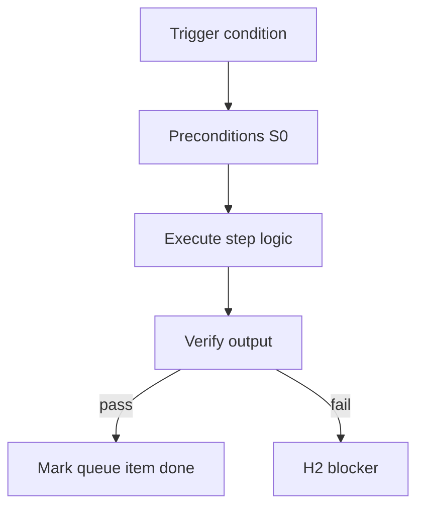

<!-- Complete pass 3 2026-06-28 MASTER-B -->

# MASTER-B: Branch B — Cognition & routing plane

**Parent:** — · **Branch MASTER** · **Vision §2** · **Release:** meta

## Reader narrative
<!-- prose-source: agent meta 2026-06-28 -->

Plane B is cognition and routing: who acts on each turn (S0 scripts through S4 governance), at what model tier, and with what interleaved product-and-self-improvement schedule. The genius-tier conductor orchestrates; economy workers implement bounded task cards.

Deterministic-first is non-negotiable: if behavior exists under scripts/, S0 runs before improvisation. Plane B connects operator policy (model-policy.json) to everyday pursuit turns.

## Purpose

MASTER-B defines branch b   cognition   routing plane for the agent-driven expert system. Top-level decomposition into ten planes.
## Scope

- Owns `MASTER-B` only; siblings under `—` must not duplicate this spec.
- Aligns with minimal HITL: H1 plan, H2 blocker, H3 sign-off ([INTRO-1.2](INTRO-1.2-human-touchpoint-contract-h1-h2-h3.md)).
- Conflicts resolve in favor of [Vision §2 — Master hierarchy (top level)](../../full-automation-vision-and-hierarchy.md#2-master-hierarchy-top-level).

```
MASTER-B branch b   cognition   routing plane
```
## Behavior / step logic
<!-- timeline-source: agent cursor-agent 2026-06-28 -->

1. On each pursuit wake, Plane B classifies the turn via [B1](B1-index.md) S0–S4: [B1.1](B1.1-s0-deterministic-mandatory-first.md) scripts run before any LLM improvises when file-derived behavior exists under `scripts/`.
2. The genius-tier [B2.1](B2.1-conductor-genius-merge-route-platform-drain.md) conductor merges worker summaries, reads `route-tier.py` output, and chooses `next_action`—spawning economy workers with bounded `allowed_reads` instead of implementing large task cards inline when `spawn_workers` is true.
3. [B3](B3-index.md) model policy binds conductor to genius tier and workers to economy tier per `docs/operator/model-policy.json`, with [B3.3](B3.3-escalation-loop-on-verify-fail.md) escalation when verification fails repeatedly.
4. [B4](B4-index.md) routing interleaves product pursuit (`next_action` task each turn) with [B4.2](B4.2-platform-promotion-queue-peek-drain.md) platform queue peek/drain on the Plane D schedule so self-improvement advances without displacing the active goal.
5. If a worker dual-writes journal/state, skips S0 preflight, or routes at the wrong tier, pursuit fails closed at H2 until the conductor reconciles routing policy—Plane B owns who acts, not what product step runs.



## JSON example

```json
{
  "node": "MASTER-B",
  "description": "branch b   cognition   routing plane",
  "state": { "ref": "APP-B-state-json-sketch.md" },
  "implemented_in_release": "v2.14+"
}
```


## Repo artifacts (this branch)


## Edge cases

- Operator closes laptop mid-loop — state.json must resume from last good dual-write.
- Concurrent manual edit to queue JSON — conductor reloads queue each wake; last writer wins with journal note.
- Edge case `MASTER-B` variant 3: verify state dual-write before continuing pursuit.
- Edge case `MASTER-B` variant 4: verify state dual-write before continuing pursuit.
- Pass 3: add regression test or evidence path specific to `MASTER-B`.
- Pass 3: cross-link related nodes in same branch index.

## Failure modes

- **Silent stop:** Agent ends turn without updating queue → mitigated by /loop + check-hierarchy-queue.py EMPTY gate.
- **False complete:** Item marked done without artifact → audit-hierarchy-depth.py re-enqueues deepen pass.
- **Scope bleed:** Worker edits journal/state during planning-only expansion → forbidden in vision-expansion-prompt.
- **Stale design:** Upstream vision § changes → reconcile-stale adds deepen items for affected ids.

## Concrete implementation

1. Map `MASTER-B` to v2.14–v2.23 release row in SEC-15-index.md.
2. Create or extend S0 script if behavior is file-derived.
3. Add unit test under tests/unit/test_master-b.py when script exists.
4. Validate `MASTER-B` against SEC-15 release checklist and parent index links.
5. Document `MASTER-B` in parent index with verify command and release tag.
6. Add checklist row in SEC-15 release doc for `MASTER-B`.

## Verification

| Check | Command |
|-------|---------|
| Completeness | `python scripts/automation/audit-hierarchy-depth.py --strict --ids MASTER-B` |
| Conformance | `python scripts/validate-workflow.py` |
| Task evidence | `python scripts/verify-router.py` when implement task exists |

## Dependencies

| Link | Why |
|------|-----|
| [full-automation-vision-and-hierarchy.md](../../full-automation-vision-and-hierarchy.md) §2 | Master hierarchy |
| [—-index](—-index.md) | Parent grouping |
| [genius-conductor-tiered-routing.md](../../genius-conductor-tiered-routing.md) | S0–S4 routing |

## Acceptance criteria

- [ ] `python scripts/automation/audit-hierarchy-depth.py --strict --ids MASTER-B` passes
- [ ] Named script, skill, or test path exists or is listed in SEC-15 release row
- [ ] Linked from [—-index](—-index.md)
- [ ] `python scripts/validate-workflow.py` passes after implement

## Cross-links

- [hierarchy-expander SKILL](../../../.cursor/skills/hierarchy-expander/SKILL.md)
