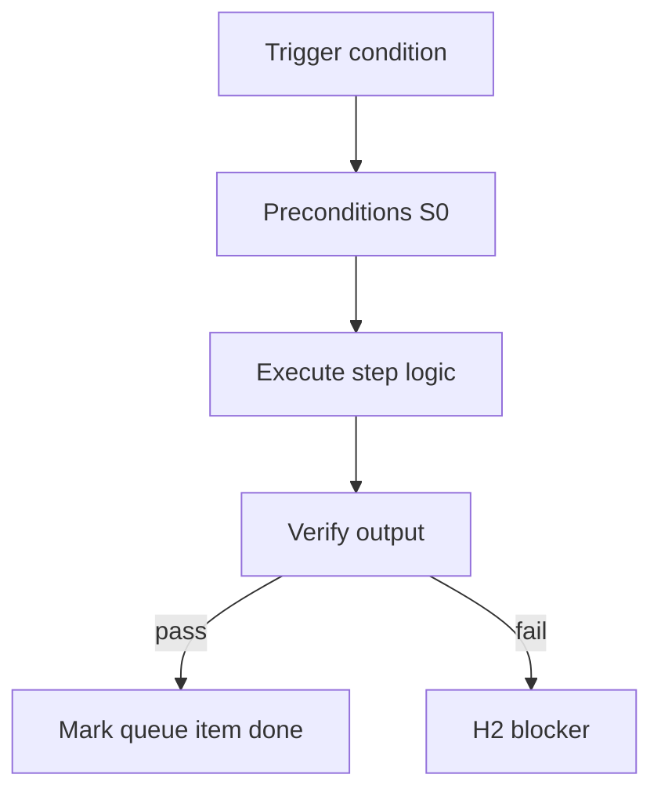

<!-- Complete pass 3 2026-06-28 MASTER-C -->

# MASTER-C: Branch C — Product execution plane

**Parent:** — · **Branch MASTER** · **Vision §2** · **Release:** meta

## Reader narrative
<!-- prose-source: agent meta 2026-06-28 -->

Plane C is product execution—the pipelines, phases, task cards, program parallelism, and feature delivery paths that turn design into shipped software with evidence. It is the familiar SDLC harness extended to run inside pursuit rather than as a separate manual workflow.

Task evidence gates remain; they feed upward into goal_verify rather than replacing it.

## Purpose

MASTER-C defines branch c   product execution plane for the agent-driven expert system. Top-level decomposition into ten planes.
## Scope

- Owns `MASTER-C` only; siblings under `—` must not duplicate this spec.
- Aligns with minimal HITL: H1 plan, H2 blocker, H3 sign-off ([INTRO-1.2](INTRO-1.2-human-touchpoint-contract-h1-h2-h3.md)).
- Conflicts resolve in favor of [Vision §2 — Master hierarchy (top level)](../../full-automation-vision-and-hierarchy.md#2-master-hierarchy-top-level).

```
MASTER-C branch c   product execution plane
```
## Behavior / step logic
<!-- timeline-source: agent cli-composer-2.5 2026-06-28 -->

1. When [A2.2](A2.2-if-ready-execute-one-pipeline-step.md) completes a skill phase, the conductor immediately runs `python scripts/route-tier.py --apply` (S0) to refresh capability_class, model_tier, and spawn_workers from the new next_action before ending the turn.
2. Journal-keeper dual-writes last_completed, next_action, evidence_files, and gates to journal/progress.md and state.json in the same update so both stores reflect the finished phase.
3. Pursuit counters for steps taken, tokens consumed, and elapsed wall-clock bump in state.json per [A1.4](A1.4-deadline-budget-steps-tokens-wall-clock.md) so the next [A2.1](A2.1-preflight-check-pipeline-blocked-extended.md) preflight judges fresh budget fields.
4. Tier recompute and counter bumps use S0 scripts only—the conductor does not spawn economy workers for housekeeping per [B1.1](B1.1-s0-deterministic-mandatory-first.md).
5. If route-tier or dual-write fails, or journal and state.json disagree after laptop resume, pursuit fails closed at H2 until journal-keeper reconciles both stores—otherwise the next wake would repeat or skip work.



## JSON example

```json
{
  "node": "MASTER-C",
  "description": "branch c   product execution plane",
  "state": { "ref": "APP-B-state-json-sketch.md" },
  "implemented_in_release": "v2.14+"
}
```


## Repo artifacts (this branch)


## Edge cases

- Operator closes laptop mid-loop — state.json must resume from last good dual-write.
- Concurrent manual edit to queue JSON — conductor reloads queue each wake; last writer wins with journal note.
- Edge case `MASTER-C` variant 3: verify state dual-write before continuing pursuit.
- Edge case `MASTER-C` variant 4: verify state dual-write before continuing pursuit.
- Pass 3: add regression test or evidence path specific to `MASTER-C`.
- Pass 3: cross-link related nodes in same branch index.

## Failure modes

- **Silent stop:** Agent ends turn without updating queue → mitigated by /loop + check-hierarchy-queue.py EMPTY gate.
- **False complete:** Item marked done without artifact → audit-hierarchy-depth.py re-enqueues deepen pass.
- **Scope bleed:** Worker edits journal/state during planning-only expansion → forbidden in vision-expansion-prompt.
- **Stale design:** Upstream vision § changes → reconcile-stale adds deepen items for affected ids.

## Concrete implementation

1. Map `MASTER-C` to v2.14–v2.23 release row in SEC-15-index.md.
2. Create or extend S0 script if behavior is file-derived.
3. Add unit test under tests/unit/test_master-c.py when script exists.
4. Validate `MASTER-C` against SEC-15 release checklist and parent index links.
5. Document `MASTER-C` in parent index with verify command and release tag.
6. Add checklist row in SEC-15 release doc for `MASTER-C`.

## Verification

| Check | Command |
|-------|---------|
| Completeness | `python scripts/automation/audit-hierarchy-depth.py --strict --ids MASTER-C` |
| Conformance | `python scripts/validate-workflow.py` |
| Task evidence | `python scripts/verify-router.py` when implement task exists |

## Dependencies

| Link | Why |
|------|-----|
| [full-automation-vision-and-hierarchy.md](../../full-automation-vision-and-hierarchy.md) §2 | Master hierarchy |
| [—-index](—-index.md) | Parent grouping |
| [genius-conductor-tiered-routing.md](../../genius-conductor-tiered-routing.md) | S0–S4 routing |

## Acceptance criteria

- [ ] `python scripts/automation/audit-hierarchy-depth.py --strict --ids MASTER-C` passes
- [ ] Named script, skill, or test path exists or is listed in SEC-15 release row
- [ ] Linked from [—-index](—-index.md)
- [ ] `python scripts/validate-workflow.py` passes after implement

## Cross-links

- [hierarchy-expander SKILL](../../../.cursor/skills/hierarchy-expander/SKILL.md)
