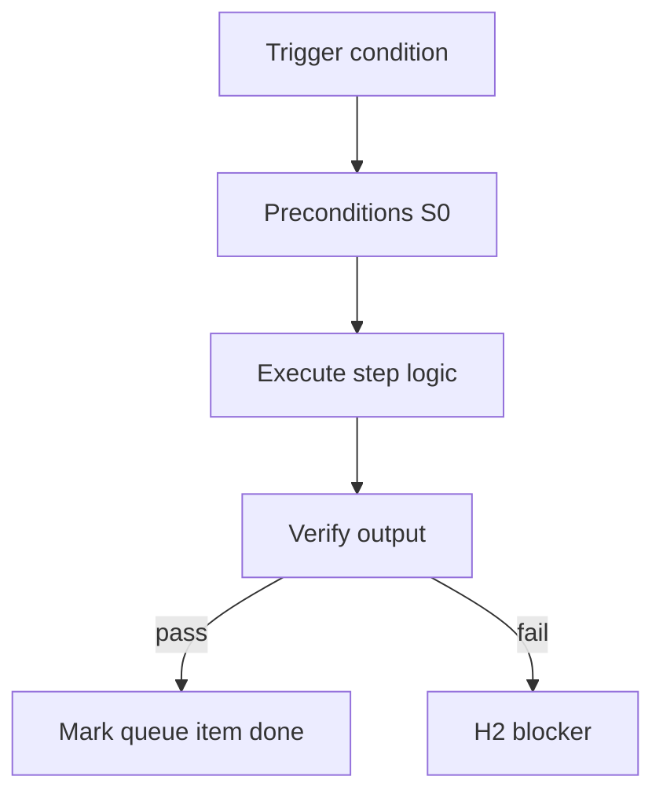

<!-- Complete pass 3 2026-06-28 MASTER-D -->

# MASTER-D: Branch D — Platform evolution plane

**Parent:** — · **Branch MASTER** · **Vision §2** · **Release:** meta

## Reader narrative
<!-- prose-source: agent meta 2026-06-28 -->

Plane D is how the system improves itself while it works. During real delivery it notices repeated mistakes, manual steps, and missing playbooks, queues them, and turns them into scripts and checks—on a schedule that runs alongside the current project so delivery keeps moving while the next project will run better.

Reuse matures from ephemeral reasoning to scripts, playbooks, and template-pack fragments—this plane owns that ladder.

## Purpose

MASTER-D defines branch d   platform evolution plane for the agent-driven expert system. Top-level decomposition into ten planes.
## Scope

- Owns `MASTER-D` only; siblings under `—` must not duplicate this spec.
- Aligns with minimal HITL: H1 plan, H2 blocker, H3 sign-off ([INTRO-1.2](INTRO-1.2-human-touchpoint-contract-h1-h2-h3.md)).
- Conflicts resolve in favor of [Vision §2 — Master hierarchy (top level)](../../full-automation-vision-and-hierarchy.md#2-master-hierarchy-top-level).

```
MASTER-D branch d   platform evolution plane
```
## Behavior / step logic
<!-- timeline-source: agent cursor-agent 2026-06-28 -->

1. During active product pursuit, [D2](D2-index.md) enqueue signals—repeated manual commands, verify gaps, worker-flagged repetition—land in the platform queue without blocking the current goal's next_action.
2. [D3](D3-index.md) scheduling drains one platform turn per K product turns (or on idle when product waits at H2) so self-improvement runs alongside delivery rather than starving the active goal.
3. Platform work follows the promotion ladder from [D1](D1-index.md): ephemeral fixes become playbooks, S0 scripts, skills, and template-pack fragments via [D4](D4-index.md) extractors.
4. Completed platform items wire into catalog, task cards, and staleness nodes per [D5](D5-index.md) and [D6](D6-index.md) so the next pursuit turn can compose reuse instead of re-improvising.
5. If platform drain would violate product budget caps from [A1.4](A1.4-deadline-budget-steps-tokens-wall-clock.md) or displace a blocked H2 product goal, scheduling defers platform turns and records the deferral in state rather than silently skipping self-improvement forever.



## JSON example

```json
{
  "node": "MASTER-D",
  "description": "branch d   platform evolution plane",
  "state": { "ref": "APP-B-state-json-sketch.md" },
  "implemented_in_release": "v2.14+"
}
```


## Repo artifacts (this branch)


## Edge cases

- Operator closes laptop mid-loop — state.json must resume from last good dual-write.
- Concurrent manual edit to queue JSON — conductor reloads queue each wake; last writer wins with journal note.
- Edge case `MASTER-D` variant 3: verify state dual-write before continuing pursuit.
- Edge case `MASTER-D` variant 4: verify state dual-write before continuing pursuit.
- Pass 3: add regression test or evidence path specific to `MASTER-D`.
- Pass 3: cross-link related nodes in same branch index.

## Failure modes

- **Silent stop:** Agent ends turn without updating queue → mitigated by /loop + check-hierarchy-queue.py EMPTY gate.
- **False complete:** Item marked done without artifact → audit-hierarchy-depth.py re-enqueues deepen pass.
- **Scope bleed:** Worker edits journal/state during planning-only expansion → forbidden in vision-expansion-prompt.
- **Stale design:** Upstream vision § changes → reconcile-stale adds deepen items for affected ids.

## Concrete implementation

1. Map `MASTER-D` to v2.14–v2.23 release row in SEC-15-index.md.
2. Create or extend S0 script if behavior is file-derived.
3. Add unit test under tests/unit/test_master-d.py when script exists.
4. Validate `MASTER-D` against SEC-15 release checklist and parent index links.
5. Document `MASTER-D` in parent index with verify command and release tag.
6. Add checklist row in SEC-15 release doc for `MASTER-D`.

## Verification

| Check | Command |
|-------|---------|
| Completeness | `python scripts/automation/audit-hierarchy-depth.py --strict --ids MASTER-D` |
| Conformance | `python scripts/validate-workflow.py` |
| Task evidence | `python scripts/verify-router.py` when implement task exists |

## Dependencies

| Link | Why |
|------|-----|
| [full-automation-vision-and-hierarchy.md](../../full-automation-vision-and-hierarchy.md) §2 | Master hierarchy |
| [—-index](—-index.md) | Parent grouping |
| [genius-conductor-tiered-routing.md](../../genius-conductor-tiered-routing.md) | S0–S4 routing |

## Acceptance criteria

- [ ] `python scripts/automation/audit-hierarchy-depth.py --strict --ids MASTER-D` passes
- [ ] Named script, skill, or test path exists or is listed in SEC-15 release row
- [ ] Linked from [—-index](—-index.md)
- [ ] `python scripts/validate-workflow.py` passes after implement

## Cross-links

- [hierarchy-expander SKILL](../../../.cursor/skills/hierarchy-expander/SKILL.md)
