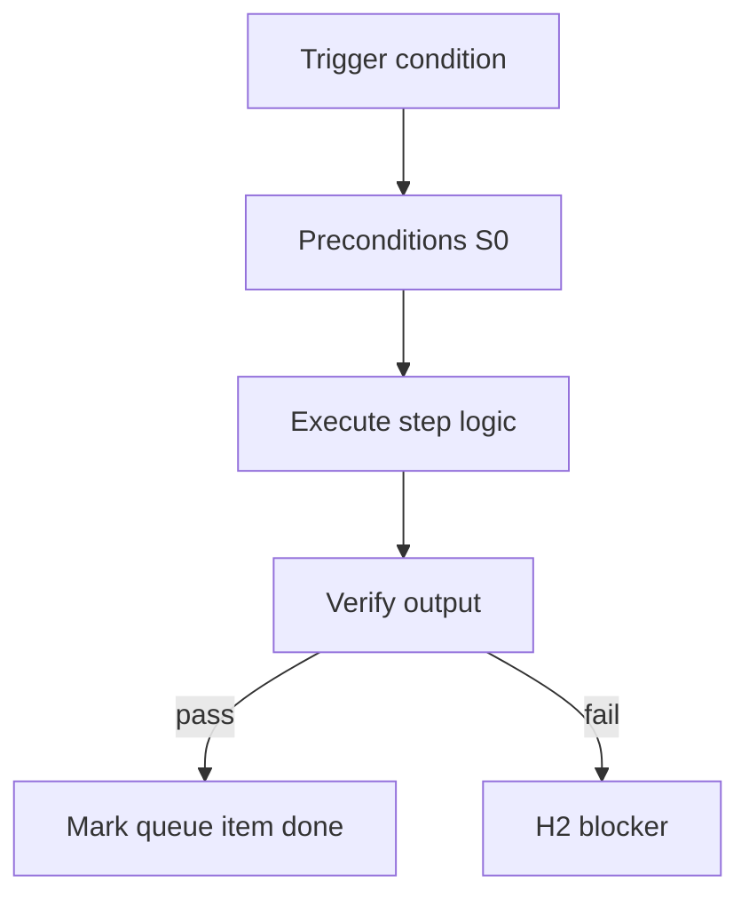

<!-- Complete pass 3 2026-06-28 MASTER-E -->

# MASTER-E: Branch E — Knowledge & composition plane

**Parent:** — · **Branch MASTER** · **Vision §2** · **Release:** meta

## Reader narrative
<!-- prose-source: agent meta 2026-06-28 -->

Plane E is knowledge and composition: one catalog surface, mandatory compose-before-invent, facts and decisions, context retrieval layers, and staleness when upstream designs change.

Before any S1+ worker invents a new pattern, Plane E requires searching the catalog and binding existing components.

## Purpose

MASTER-E defines branch e   knowledge   composition plane for the agent-driven expert system. Top-level decomposition into ten planes.
## Scope

- Owns `MASTER-E` only; siblings under `—` must not duplicate this spec.
- Aligns with minimal HITL: H1 plan, H2 blocker, H3 sign-off ([INTRO-1.2](INTRO-1.2-human-touchpoint-contract-h1-h2-h3.md)).
- Conflicts resolve in favor of [Vision §2 — Master hierarchy (top level)](../../full-automation-vision-and-hierarchy.md#2-master-hierarchy-top-level).

```
MASTER-E branch e   knowledge   composition plane
```
## Behavior / step logic
<!-- timeline-source: agent cli-composer-2.5 2026-06-28 -->

1. Understand that this plane knowledge and composition: one catalog surface, mandatory compose-before-invent, facts and decisions, context retrieval layers, and staleness when upstream designs change
2. Before any S1+ worker invents a new pattern, Plane E requires searching the catalog and binding existing components
3. Plane meta groups related capabilities; this master summary orients readers before opening meta1–meta6 detail pages.
4. Each child capability under Plane meta must stay consistent with this plane’s role in pursuit, routing, or verification.
5. Operators use master pages as reading order hints—not as separate runtime state.



## JSON example

```json
{
  "node": "MASTER-E",
  "description": "branch e   knowledge   composition plane",
  "state": { "ref": "APP-B-state-json-sketch.md" },
  "implemented_in_release": "v2.14+"
}
```


## Repo artifacts (this branch)


## Edge cases

- Operator closes laptop mid-loop — state.json must resume from last good dual-write.
- Concurrent manual edit to queue JSON — conductor reloads queue each wake; last writer wins with journal note.
- Edge case `MASTER-E` variant 3: verify state dual-write before continuing pursuit.
- Edge case `MASTER-E` variant 4: verify state dual-write before continuing pursuit.
- Pass 3: add regression test or evidence path specific to `MASTER-E`.
- Pass 3: cross-link related nodes in same branch index.

## Failure modes

- **Silent stop:** Agent ends turn without updating queue → mitigated by /loop + check-hierarchy-queue.py EMPTY gate.
- **False complete:** Item marked done without artifact → audit-hierarchy-depth.py re-enqueues deepen pass.
- **Scope bleed:** Worker edits journal/state during planning-only expansion → forbidden in vision-expansion-prompt.
- **Stale design:** Upstream vision § changes → reconcile-stale adds deepen items for affected ids.

## Concrete implementation

1. Map `MASTER-E` to v2.14–v2.23 release row in SEC-15-index.md.
2. Create or extend S0 script if behavior is file-derived.
3. Add unit test under tests/unit/test_master-e.py when script exists.
4. Validate `MASTER-E` against SEC-15 release checklist and parent index links.
5. Document `MASTER-E` in parent index with verify command and release tag.
6. Add checklist row in SEC-15 release doc for `MASTER-E`.

## Verification

| Check | Command |
|-------|---------|
| Completeness | `python scripts/automation/audit-hierarchy-depth.py --strict --ids MASTER-E` |
| Conformance | `python scripts/validate-workflow.py` |
| Task evidence | `python scripts/verify-router.py` when implement task exists |

## Dependencies

| Link | Why |
|------|-----|
| [full-automation-vision-and-hierarchy.md](../../full-automation-vision-and-hierarchy.md) §2 | Master hierarchy |
| [—-index](—-index.md) | Parent grouping |
| [genius-conductor-tiered-routing.md](../../genius-conductor-tiered-routing.md) | S0–S4 routing |

## Acceptance criteria

- [ ] `python scripts/automation/audit-hierarchy-depth.py --strict --ids MASTER-E` passes
- [ ] Named script, skill, or test path exists or is listed in SEC-15 release row
- [ ] Linked from [—-index](—-index.md)
- [ ] `python scripts/validate-workflow.py` passes after implement

## Cross-links

- [hierarchy-expander SKILL](../../../.cursor/skills/hierarchy-expander/SKILL.md)
