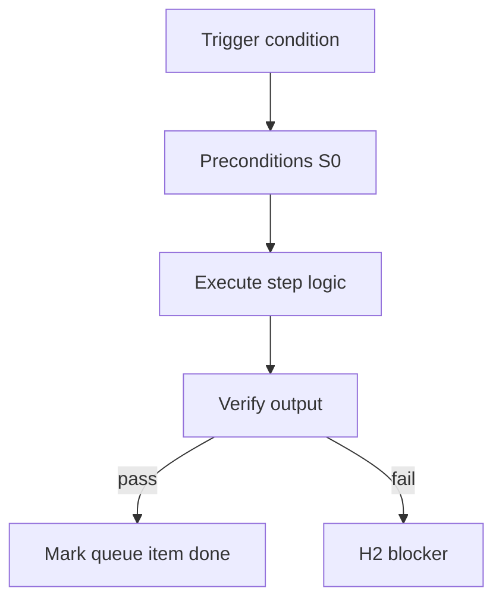

<!-- Complete pass 3 2026-06-28 MASTER-G -->

# MASTER-G: Branch G — Verification & quality plane

**Parent:** — · **Branch MASTER** · **Vision §2** · **Release:** meta

## Reader narrative
<!-- prose-source: agent meta 2026-06-28 -->

Plane G is verification and quality: evidence gates, goal-level verification, workflow conformance, automated review triggers, mistake-class controls, and rollback. It ensures "done" means proven, not asserted.

Task-level verify-router evidence is necessary; goal_verify is sufficient for H3.

## Purpose

MASTER-G defines branch g   verification   quality plane for the agent-driven expert system. Top-level decomposition into ten planes.
## Scope

- Owns `MASTER-G` only; siblings under `—` must not duplicate this spec.
- Aligns with minimal HITL: H1 plan, H2 blocker, H3 sign-off ([INTRO-1.2](INTRO-1.2-human-touchpoint-contract-h1-h2-h3.md)).
- Conflicts resolve in favor of [Vision §2 — Master hierarchy (top level)](../../full-automation-vision-and-hierarchy.md#2-master-hierarchy-top-level).

```
MASTER-G branch g   verification   quality plane
```
## Behavior / step logic
<!-- timeline-source: agent cursor-agent 2026-06-28 -->

1. Plane G ensures done means proven: task-level verify-router evidence is necessary before implement tasks advance per [G1](G1-index.md), and goal_verify is sufficient before H3 closure per [G2](G2-index.md).
2. After each implement batch, verifier or verify-router runs the task card Test/Tool command and writes evidence logs when evidence_required is true—advancement blocked until last_verify=passed.
3. When scope completes, [G2.1](G2.1-goal-verify-command-state-pack.md) aggregates unit, integration, e2e, and tool proof via goal_verify_command; [G2.3](G2.3-goal-verify-blocks-h3-until-pass.md) prevents H3 pending until aggregate passes.
4. [G3](G3-index.md) conformance checks (validate-workflow, route-tier) run S0 before pursuit improvises; [G4](G4-index.md) review triggers fire on large diffs or touch-path changes; [G5](G5-index.md) mistake-class guards block hallucinated done states.
5. If verification fails, regression appears mid-pursuit, or evidence paths go stale, Plane G emits verify stops per [A4.2](A4.2-stop-verify-evidence-goal-verify-regression.md) and goal.state stays pursuing until proof reconciles.



## JSON example

```json
{
  "node": "MASTER-G",
  "description": "branch g   verification   quality plane",
  "state": { "ref": "APP-B-state-json-sketch.md" },
  "implemented_in_release": "v2.14+"
}
```


## Repo artifacts (this branch)


## Edge cases

- Operator closes laptop mid-loop — state.json must resume from last good dual-write.
- Concurrent manual edit to queue JSON — conductor reloads queue each wake; last writer wins with journal note.
- Edge case `MASTER-G` variant 3: verify state dual-write before continuing pursuit.
- Edge case `MASTER-G` variant 4: verify state dual-write before continuing pursuit.
- Pass 3: add regression test or evidence path specific to `MASTER-G`.
- Pass 3: cross-link related nodes in same branch index.

## Failure modes

- **Silent stop:** Agent ends turn without updating queue → mitigated by /loop + check-hierarchy-queue.py EMPTY gate.
- **False complete:** Item marked done without artifact → audit-hierarchy-depth.py re-enqueues deepen pass.
- **Scope bleed:** Worker edits journal/state during planning-only expansion → forbidden in vision-expansion-prompt.
- **Stale design:** Upstream vision § changes → reconcile-stale adds deepen items for affected ids.

## Concrete implementation

1. Map `MASTER-G` to v2.14–v2.23 release row in SEC-15-index.md.
2. Create or extend S0 script if behavior is file-derived.
3. Add unit test under tests/unit/test_master-g.py when script exists.
4. Validate `MASTER-G` against SEC-15 release checklist and parent index links.
5. Document `MASTER-G` in parent index with verify command and release tag.
6. Add checklist row in SEC-15 release doc for `MASTER-G`.

## Verification

| Check | Command |
|-------|---------|
| Completeness | `python scripts/automation/audit-hierarchy-depth.py --strict --ids MASTER-G` |
| Conformance | `python scripts/validate-workflow.py` |
| Task evidence | `python scripts/verify-router.py` when implement task exists |

## Dependencies

| Link | Why |
|------|-----|
| [full-automation-vision-and-hierarchy.md](../../full-automation-vision-and-hierarchy.md) §2 | Master hierarchy |
| [—-index](—-index.md) | Parent grouping |
| [genius-conductor-tiered-routing.md](../../genius-conductor-tiered-routing.md) | S0–S4 routing |

## Acceptance criteria

- [ ] `python scripts/automation/audit-hierarchy-depth.py --strict --ids MASTER-G` passes
- [ ] Named script, skill, or test path exists or is listed in SEC-15 release row
- [ ] Linked from [—-index](—-index.md)
- [ ] `python scripts/validate-workflow.py` passes after implement

## Cross-links

- [hierarchy-expander SKILL](../../../.cursor/skills/hierarchy-expander/SKILL.md)
