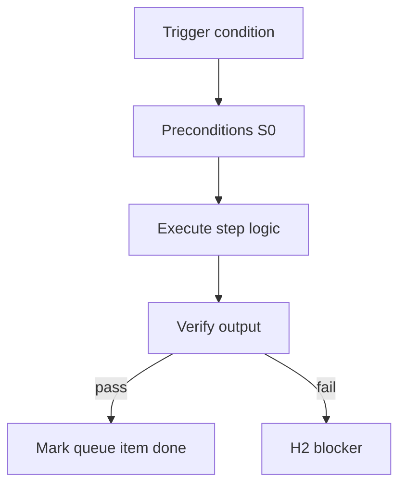

<!-- Complete pass 3 2026-06-28 MASTER-H -->

# MASTER-H: Branch H — Persistence & state plane

**Parent:** — · **Branch MASTER** · **Vision §2** · **Release:** meta

## Reader narrative
<!-- prose-source: agent meta 2026-06-28 -->

Plane H persists state—journal and machine state dual-write, artifact graphs, immutable evidence logs, worker audit trails, and snapshots for resume after compaction or crash.

If Plane A is the heartbeat, Plane H is the memory that makes restart safe.

## Purpose

MASTER-H defines branch h   persistence   state plane for the agent-driven expert system. Top-level decomposition into ten planes.
## Scope

- Owns `MASTER-H` only; siblings under `—` must not duplicate this spec.
- Aligns with minimal HITL: H1 plan, H2 blocker, H3 sign-off ([INTRO-1.2](INTRO-1.2-human-touchpoint-contract-h1-h2-h3.md)).
- Conflicts resolve in favor of [Vision §2 — Master hierarchy (top level)](../../full-automation-vision-and-hierarchy.md#2-master-hierarchy-top-level).

```
MASTER-H branch h   persistence   state plane
```
## Behavior / step logic
<!-- timeline-source: agent cli-composer-2.5 2026-06-28 -->

1. With pursuit mode `company_autopilot`, the conductor maintains a multi-goal queue in state.json scoped by the active template-pack from Plane F—selecting the next ready goal by dependencies, role bindings, and platform slots rather than a single perpetual goal.
2. Each wake runs [A2.1](A2.1-preflight-check-pipeline-blocked-extended.md) preflight against the active goal slice; H2 on one stream dual-writes a blocker for that goal only while other ready goals may still advance if preflight allows.
3. [B5.2](B5.2-role-to-pipeline-id-skills-tool-permissions.md) `active_role` rotates so the conductor context-switches `pipeline_id`, skills, and `allowed_reads` per selected goal—workers never dual-write journal or state.
4. When one goal reaches H3 pending after [A2.5](A2.5-goal-verify-pass-transition-h3-pending.md), sibling goals in the company queue may continue pursuit if their streams are unblocked—organizational throughput without abandoning strict HITL on verified closures.
5. If the scheduler picks a goal with unresolved dependencies or corrupt queue state, preflight fails closed at H2 until journal-keeper reconciles the multi-goal manifest per [SEC-17-6](SEC-17-6-decision-multi-goal-single-stack-vs-company-autopilot.md).



## JSON example

```json
{
  "node": "MASTER-H",
  "description": "branch h   persistence   state plane",
  "state": { "ref": "APP-B-state-json-sketch.md" },
  "implemented_in_release": "v2.14+"
}
```


## Repo artifacts (this branch)


## Edge cases

- Operator closes laptop mid-loop — state.json must resume from last good dual-write.
- Concurrent manual edit to queue JSON — conductor reloads queue each wake; last writer wins with journal note.
- Edge case `MASTER-H` variant 3: verify state dual-write before continuing pursuit.
- Edge case `MASTER-H` variant 4: verify state dual-write before continuing pursuit.
- Pass 3: add regression test or evidence path specific to `MASTER-H`.
- Pass 3: cross-link related nodes in same branch index.

## Failure modes

- **Silent stop:** Agent ends turn without updating queue → mitigated by /loop + check-hierarchy-queue.py EMPTY gate.
- **False complete:** Item marked done without artifact → audit-hierarchy-depth.py re-enqueues deepen pass.
- **Scope bleed:** Worker edits journal/state during planning-only expansion → forbidden in vision-expansion-prompt.
- **Stale design:** Upstream vision § changes → reconcile-stale adds deepen items for affected ids.

## Concrete implementation

1. Map `MASTER-H` to v2.14–v2.23 release row in SEC-15-index.md.
2. Create or extend S0 script if behavior is file-derived.
3. Add unit test under tests/unit/test_master-h.py when script exists.
4. Validate `MASTER-H` against SEC-15 release checklist and parent index links.
5. Document `MASTER-H` in parent index with verify command and release tag.
6. Add checklist row in SEC-15 release doc for `MASTER-H`.

## Verification

| Check | Command |
|-------|---------|
| Completeness | `python scripts/automation/audit-hierarchy-depth.py --strict --ids MASTER-H` |
| Conformance | `python scripts/validate-workflow.py` |
| Task evidence | `python scripts/verify-router.py` when implement task exists |

## Dependencies

| Link | Why |
|------|-----|
| [full-automation-vision-and-hierarchy.md](../../full-automation-vision-and-hierarchy.md) §2 | Master hierarchy |
| [—-index](—-index.md) | Parent grouping |
| [genius-conductor-tiered-routing.md](../../genius-conductor-tiered-routing.md) | S0–S4 routing |

## Acceptance criteria

- [ ] `python scripts/automation/audit-hierarchy-depth.py --strict --ids MASTER-H` passes
- [ ] Named script, skill, or test path exists or is listed in SEC-15 release row
- [ ] Linked from [—-index](—-index.md)
- [ ] `python scripts/validate-workflow.py` passes after implement

## Cross-links

- [hierarchy-expander SKILL](../../../.cursor/skills/hierarchy-expander/SKILL.md)
