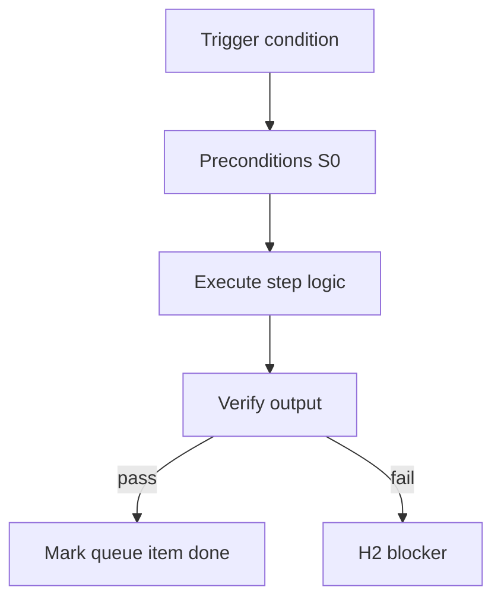

<!-- Complete pass 3 2026-06-28 MASTER-I -->

# MASTER-I: Branch I — Runtime & integration plane

**Parent:** — · **Branch MASTER** · **Vision §2** · **Release:** meta

## Reader narrative
<!-- prose-source: agent meta 2026-06-28 -->

Plane I integrates runtimes: Cursor IDE sessions, local SDK daemon, headless CI, external tools via MCP, and operator notifications on H2/H3 only.

The same pursuit semantics must hold whether the conductor runs in-editor or headless. Hooks (beforeSubmitPrompt, preToolUse, preCompact) and SDK daemon loops are part of this plane—not optional integrations.

## Purpose

MASTER-I defines branch i   runtime   integration plane for the agent-driven expert system. Top-level decomposition into ten planes.
## Scope

- Owns `MASTER-I` only; siblings under `—` must not duplicate this spec.
- Aligns with minimal HITL: H1 plan, H2 blocker, H3 sign-off ([INTRO-1.2](INTRO-1.2-human-touchpoint-contract-h1-h2-h3.md)).
- Conflicts resolve in favor of [Vision §2 — Master hierarchy (top level)](../../full-automation-vision-and-hierarchy.md#2-master-hierarchy-top-level).

```
MASTER-I branch i   runtime   integration plane
```
## Behavior / step logic
<!-- timeline-source: agent cli-composer-2.5 2026-06-28 -->

1. After H1 approves a plan, pursuit enters the canonical always-on loop: [A2.1](A2.1-preflight-check-pipeline-blocked-extended.md) preflight, then [A2.2](A2.2-if-ready-execute-one-pipeline-step.md) one skill phase, then [A2.3](A2.3-post-step-route-tier-dual-write-increment.md) post-step dual-write—repeating until a termination condition from the A4 stop taxonomy fires.
2. Each iteration stays bounded by [A2.4](A2.4-goal-scope-complete-run-goal-verify.md) goal_verify handoff and [A2.5](A2.5-goal-verify-pass-transition-h3-pending.md) H3-pending transition so scope completion and human final sign-off remain part of the cycle, not bypassed by the loop.
3. The loop terminates on check-pipeline-blocked BLOCKED (H2), budget exhaustion per [A1.4](A1.4-deadline-budget-steps-tokens-wall-clock.md), goal.state achieved after H3 acceptance, or H3 rejection that returns pursuit to active work with structured notes.
4. The same control flow runs whether the runtime is IDE `/autopilot`, local SDK daemon, or headless CI—Plane I hosts execution but must not invent alternate while-loop semantics across runtimes.
5. If dual-write fails mid-loop or journal and state.json diverge, pursuit halts at H2 before the next wake; resume always restarts from reconciled state at [A2.1](A2.1-preflight-check-pipeline-blocked-extended.md) preflight.



## JSON example

```json
{
  "node": "MASTER-I",
  "description": "branch i   runtime   integration plane",
  "state": { "ref": "APP-B-state-json-sketch.md" },
  "implemented_in_release": "v2.14+"
}
```


## Repo artifacts (this branch)


## Edge cases

- Operator closes laptop mid-loop — state.json must resume from last good dual-write.
- Concurrent manual edit to queue JSON — conductor reloads queue each wake; last writer wins with journal note.
- Edge case `MASTER-I` variant 3: verify state dual-write before continuing pursuit.
- Edge case `MASTER-I` variant 4: verify state dual-write before continuing pursuit.
- Pass 3: add regression test or evidence path specific to `MASTER-I`.
- Pass 3: cross-link related nodes in same branch index.

## Failure modes

- **Silent stop:** Agent ends turn without updating queue → mitigated by /loop + check-hierarchy-queue.py EMPTY gate.
- **False complete:** Item marked done without artifact → audit-hierarchy-depth.py re-enqueues deepen pass.
- **Scope bleed:** Worker edits journal/state during planning-only expansion → forbidden in vision-expansion-prompt.
- **Stale design:** Upstream vision § changes → reconcile-stale adds deepen items for affected ids.

## Concrete implementation

1. Map `MASTER-I` to v2.14–v2.23 release row in SEC-15-index.md.
2. Create or extend S0 script if behavior is file-derived.
3. Add unit test under tests/unit/test_master-i.py when script exists.
4. Validate `MASTER-I` against SEC-15 release checklist and parent index links.
5. Document `MASTER-I` in parent index with verify command and release tag.
6. Add checklist row in SEC-15 release doc for `MASTER-I`.

## Verification

| Check | Command |
|-------|---------|
| Completeness | `python scripts/automation/audit-hierarchy-depth.py --strict --ids MASTER-I` |
| Conformance | `python scripts/validate-workflow.py` |
| Task evidence | `python scripts/verify-router.py` when implement task exists |

## Dependencies

| Link | Why |
|------|-----|
| [full-automation-vision-and-hierarchy.md](../../full-automation-vision-and-hierarchy.md) §2 | Master hierarchy |
| [—-index](—-index.md) | Parent grouping |
| [genius-conductor-tiered-routing.md](../../genius-conductor-tiered-routing.md) | S0–S4 routing |

## Acceptance criteria

- [ ] `python scripts/automation/audit-hierarchy-depth.py --strict --ids MASTER-I` passes
- [ ] Named script, skill, or test path exists or is listed in SEC-15 release row
- [ ] Linked from [—-index](—-index.md)
- [ ] `python scripts/validate-workflow.py` passes after implement

## Cross-links

- [hierarchy-expander SKILL](../../../.cursor/skills/hierarchy-expander/SKILL.md)
