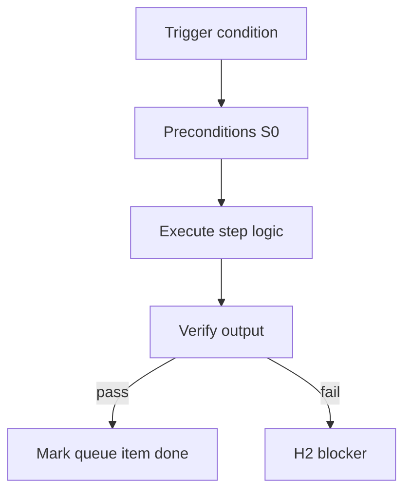

<!-- Complete pass 3 2026-06-28 MASTER-J -->

# MASTER-J: Branch J — Governance & operator plane

**Parent:** — · **Branch MASTER** · **Vision §2** · **Release:** meta

## Reader narrative
<!-- prose-source: agent meta 2026-06-28 -->

Plane J governs operators—model policy, automation waivers, optional strict HITL, audit of waivers, export contracts for external orchestrators, and release-queue evolution for the harness itself (separate from consumer goals).

Operator-facing policy lives here; consumer product goals should not mutate these artifacts without platform intent.

## Purpose

MASTER-J defines branch j   governance   operator plane for the agent-driven expert system. Top-level decomposition into ten planes.
## Scope

- Owns `MASTER-J` only; siblings under `—` must not duplicate this spec.
- Aligns with minimal HITL: H1 plan, H2 blocker, H3 sign-off ([INTRO-1.2](INTRO-1.2-human-touchpoint-contract-h1-h2-h3.md)).
- Conflicts resolve in favor of [Vision §2 — Master hierarchy (top level)](../../full-automation-vision-and-hierarchy.md#2-master-hierarchy-top-level).

```
MASTER-J branch j   governance   operator plane
```
## Behavior / step logic
<!-- timeline-source: agent cli-composer-2.5 2026-06-28 -->

1. After H1 approves the plan and the A1 goal model is populated, the operator enables goal_autopilot via autopilot.active with pursuit.mode set to goal_autopilot—lifting the per-session ceiling from [A3.1](A3.1-session-autopilot-max-steps-per-session.md) so pursuit continues across wakes until termination.
2. Each wake runs [A2.1](A2.1-preflight-check-pipeline-blocked-extended.md) preflight, exactly one [A2.2](A2.2-if-ready-execute-one-pipeline-step.md) pipeline phase, and [A2.3](A2.3-post-step-route-tier-dual-write-increment.md) dual-write—matching [A2.7](A2.7-no-intermediate-wait-for-continue.md) one-phase-per-turn semantics across unlimited iterations without waiting for manual Continue.
3. When machine-checkable scope completion fires, [A2.4](A2.4-goal-scope-complete-run-goal-verify.md) runs goal_verify_command via [G2.1](G2.1-goal-verify-command-state-pack.md) instead of scheduling another implement-feature turn.
4. Termination follows the [A4](A4-index.md) stop taxonomy—hard blocks become H2, [A1.4](A1.4-deadline-budget-steps-tokens-wall-clock.md) budget caps dual-write structured stop reasons, and goal_verify success transitions to [A2.5](A2.5-goal-verify-pass-transition-h3-pending.md) H3 pending.
5. If goal_verify fails, preflight cannot classify a stop reason, or required evidence goes stale mid-run, pursuit halts at H2 and goal.state stays pursuing until scope and proof reconcile.



## JSON example

```json
{
  "node": "MASTER-J",
  "description": "branch j   governance   operator plane",
  "state": { "ref": "APP-B-state-json-sketch.md" },
  "implemented_in_release": "v2.14+"
}
```


## Repo artifacts (this branch)


## Edge cases

- Operator closes laptop mid-loop — state.json must resume from last good dual-write.
- Concurrent manual edit to queue JSON — conductor reloads queue each wake; last writer wins with journal note.
- Edge case `MASTER-J` variant 3: verify state dual-write before continuing pursuit.
- Edge case `MASTER-J` variant 4: verify state dual-write before continuing pursuit.
- Pass 3: add regression test or evidence path specific to `MASTER-J`.
- Pass 3: cross-link related nodes in same branch index.

## Failure modes

- **Silent stop:** Agent ends turn without updating queue → mitigated by /loop + check-hierarchy-queue.py EMPTY gate.
- **False complete:** Item marked done without artifact → audit-hierarchy-depth.py re-enqueues deepen pass.
- **Scope bleed:** Worker edits journal/state during planning-only expansion → forbidden in vision-expansion-prompt.
- **Stale design:** Upstream vision § changes → reconcile-stale adds deepen items for affected ids.

## Concrete implementation

1. Map `MASTER-J` to v2.14–v2.23 release row in SEC-15-index.md.
2. Create or extend S0 script if behavior is file-derived.
3. Add unit test under tests/unit/test_master-j.py when script exists.
4. Validate `MASTER-J` against SEC-15 release checklist and parent index links.
5. Document `MASTER-J` in parent index with verify command and release tag.
6. Add checklist row in SEC-15 release doc for `MASTER-J`.

## Verification

| Check | Command |
|-------|---------|
| Completeness | `python scripts/automation/audit-hierarchy-depth.py --strict --ids MASTER-J` |
| Conformance | `python scripts/validate-workflow.py` |
| Task evidence | `python scripts/verify-router.py` when implement task exists |

## Dependencies

| Link | Why |
|------|-----|
| [full-automation-vision-and-hierarchy.md](../../full-automation-vision-and-hierarchy.md) §2 | Master hierarchy |
| [—-index](—-index.md) | Parent grouping |
| [genius-conductor-tiered-routing.md](../../genius-conductor-tiered-routing.md) | S0–S4 routing |

## Acceptance criteria

- [ ] `python scripts/automation/audit-hierarchy-depth.py --strict --ids MASTER-J` passes
- [ ] Named script, skill, or test path exists or is listed in SEC-15 release row
- [ ] Linked from [—-index](—-index.md)
- [ ] `python scripts/validate-workflow.py` passes after implement

## Cross-links

- [hierarchy-expander SKILL](../../../.cursor/skills/hierarchy-expander/SKILL.md)
