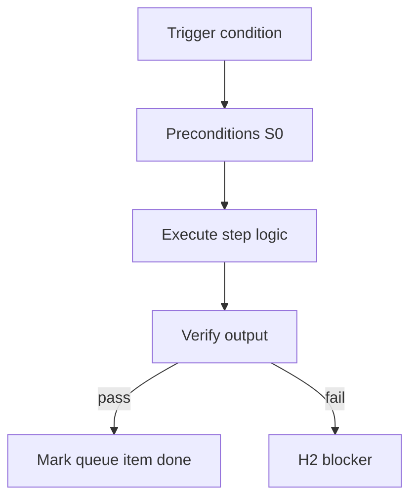

<!-- Complete pass 3 2026-06-28 SEC-13 -->

# SEC-13: pursuit flow

**Parent:** — · **Branch SEC** · **Vision §13** · **Release:** v2.15

## Reader narrative
<!-- prose-source: agent meta 2026-06-28 -->

This chapter is the single picture of how the target system behaves end to end after H1 approves a plan. Pursuit loops: preflight, one pipeline step, optional platform queue drain every K steps, product step otherwise, repeat until scope completes, then goal_verify, then H3 on pass or H2 on failure.

The diagram in the vision document is the authoritative control flow—use it when tracing any A2 or C2 capability back to overall behavior. Project steps and self-improvement steps alternate on a fixed schedule so neither the current goal nor the improvement backlog is neglected—scheduling is explicit in the loop, not ad hoc.

## Purpose

SEC-13 defines pursuit flow for the agent-driven expert system. Roadmap, gap analysis, pursuit flow, decisions.
## Scope

- Owns `SEC-13` only; siblings under `—` must not duplicate this spec.
- Aligns with minimal HITL: H1 plan, H2 blocker, H3 sign-off ([INTRO-1.2](INTRO-1.2-human-touchpoint-contract-h1-h2-h3.md)).
- Conflicts resolve in favor of [Vision §13 — End-to-end pursuit flow (target)](../../full-automation-vision-and-hierarchy.md#13-end-to-end-pursuit-flow-target).

```
SEC-13 pursuit flow
```
## Behavior / step logic
<!-- timeline-source: agent cli-composer-2.5 2026-06-28 -->

1. Pursuit loops: preflight, one pipeline step, optional platform queue drain every K steps, product step otherwise, repeat until scope completes, then goal_verify, then H3 on pass or H2 on failure
2. The diagram in the vision document is the authoritative control flow—use it when tracing any A2 or C2 capability back to overall behavior
3. This section documents cross-cutting architecture: pursuit flow, migration gaps, or release sequencing for the expert system.
4. Implementers treat SEC rows as program backlog ordering, not as ad hoc prose.
5. Release slices (SEC-15) map harness versions to shippable capability bundles.



## JSON example

```json
{
  "node": "SEC-13",
  "description": "pursuit flow",
  "state": { "ref": "APP-B-state-json-sketch.md" },
  "implemented_in_release": "v2.14+"
}
```


## Repo artifacts (this branch)


## Edge cases

- Operator closes laptop mid-loop — state.json must resume from last good dual-write.
- Concurrent manual edit to queue JSON — conductor reloads queue each wake; last writer wins with journal note.
- Edge case `SEC-13` variant 3: verify state dual-write before continuing pursuit.
- Edge case `SEC-13` variant 4: verify state dual-write before continuing pursuit.
- Pass 3: add regression test or evidence path specific to `SEC-13`.
- Pass 3: cross-link related nodes in same branch index.

## Failure modes

- **Silent stop:** Agent ends turn without updating queue → mitigated by /loop + check-hierarchy-queue.py EMPTY gate.
- **False complete:** Item marked done without artifact → audit-hierarchy-depth.py re-enqueues deepen pass.
- **Scope bleed:** Worker edits journal/state during planning-only expansion → forbidden in vision-expansion-prompt.
- **Stale design:** Upstream vision § changes → reconcile-stale adds deepen items for affected ids.

## Concrete implementation

1. Map `SEC-13` to v2.14–v2.23 release row in SEC-15-index.md.
2. Create or extend S0 script if behavior is file-derived.
3. Add unit test under tests/unit/test_sec-13.py when script exists.
4. Validate `SEC-13` against SEC-15 release checklist and parent index links.
5. Document `SEC-13` in parent index with verify command and release tag.
6. Add checklist row in SEC-15 release doc for `SEC-13`.

## Verification

| Check | Command |
|-------|---------|
| Completeness | `python scripts/automation/audit-hierarchy-depth.py --strict --ids SEC-13` |
| Conformance | `python scripts/validate-workflow.py` |
| Task evidence | `python scripts/verify-router.py` when implement task exists |

## Dependencies

| Link | Why |
|------|-----|
| [full-automation-vision-and-hierarchy.md](../../full-automation-vision-and-hierarchy.md) §13 | Master hierarchy |
| [—-index](—-index.md) | Parent grouping |
| [genius-conductor-tiered-routing.md](../../genius-conductor-tiered-routing.md) | S0–S4 routing |

## Acceptance criteria

- [ ] `python scripts/automation/audit-hierarchy-depth.py --strict --ids SEC-13` passes
- [ ] Named script, skill, or test path exists or is listed in SEC-15 release row
- [ ] Linked from [—-index](—-index.md)
- [ ] `python scripts/validate-workflow.py` passes after implement

## Cross-links

- [hierarchy-expander SKILL](../../../.cursor/skills/hierarchy-expander/SKILL.md)
