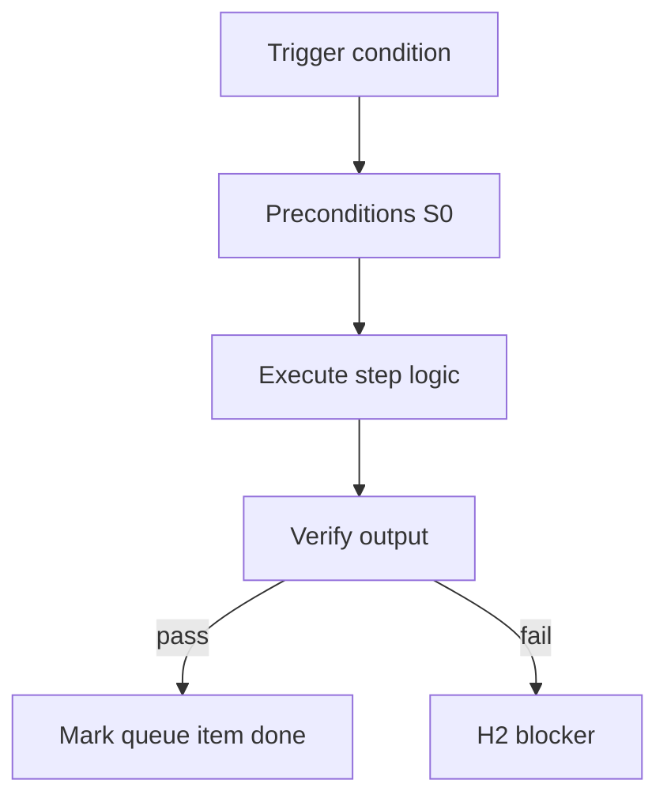

<!-- Complete pass 3 2026-06-28 SEC-14 -->

# SEC-14: gap analysis

**Parent:** — · **Branch SEC** · **Vision §14** · **Release:** meta

## Reader narrative
<!-- prose-source: agent meta 2026-06-28 -->

Gap analysis makes the migration from today's harness to the target architecture auditable. Each row names what v2.13 does today, what the north star requires, and which plane sections bridge the gap—pursuit loop depth, human gate reduction, platform queue, catalog compose-first, **transistor generator workflows (v2.24+)**, pack schema, goal_verify, role switching, and stop-reason taxonomy.

Implementers should treat this table as a program backlog ordered by SEC-15 releases rather than as prose alone.

## Purpose

SEC-14 defines gap analysis for the agent-driven expert system. Roadmap, gap analysis, pursuit flow, decisions.
## Scope

- Owns `SEC-14` only; siblings under `—` must not duplicate this spec.
- Aligns with minimal HITL: H1 plan, H2 blocker, H3 sign-off ([INTRO-1.2](INTRO-1.2-human-touchpoint-contract-h1-h2-h3.md)).
- Conflicts resolve in favor of [Vision §14 — Gap analysis: today → target](../../full-automation-vision-and-hierarchy.md#14-gap-analysis-today-target).

```
SEC-14 gap analysis
```
## Behavior / step logic
<!-- timeline-source: agent cli-composer-2.5 2026-06-28 -->

1. When program-scoper decomposes a mega-spec, integration-manifest-keeper drafts `docs/program/integration/manifest.md` with API surfaces, shared schemas, test harness boundaries, and per-stream completion criteria—the cross-stream contract before parallel lanes execute.
2. Parallel implement via [C4.2](C4.2-orchestrate-program.md) and [C4.1](C4.1-workstreams-lane-json-leases.md) stays BLOCKED at [A2.1](A2.1-preflight-check-pipeline-blocked-extended.md) until manifest approval clears H1 (or pack self-gate with verify suite when pack policy allows).
3. Each lane worker receives only its manifest slice through Librarian `allowed_reads`; lane scope must not drift beyond declared integration boundaries in the contract.
4. Manifest edits mark artifact graph nodes stale via reconcile-artifact-graph; dependent lanes pause at preflight until reconcile-stale completes and journal records reconciliation.
5. If manifest gaps leave stream boundaries ambiguous or lanes implement against an unapproved contract, program goal_verify fails closed at H2 until manifest-keeper updates the contract and operators re-approve.



## JSON example

```json
{
  "node": "SEC-14",
  "description": "gap analysis",
  "state": { "ref": "APP-B-state-json-sketch.md" },
  "implemented_in_release": "v2.14+"
}
```


## Repo artifacts (this branch)


## Edge cases

- Operator closes laptop mid-loop — state.json must resume from last good dual-write.
- Concurrent manual edit to queue JSON — conductor reloads queue each wake; last writer wins with journal note.
- Edge case `SEC-14` variant 3: verify state dual-write before continuing pursuit.
- Edge case `SEC-14` variant 4: verify state dual-write before continuing pursuit.
- Pass 3: add regression test or evidence path specific to `SEC-14`.
- Pass 3: cross-link related nodes in same branch index.

## Failure modes

- **Silent stop:** Agent ends turn without updating queue → mitigated by /loop + check-hierarchy-queue.py EMPTY gate.
- **False complete:** Item marked done without artifact → audit-hierarchy-depth.py re-enqueues deepen pass.
- **Scope bleed:** Worker edits journal/state during planning-only expansion → forbidden in vision-expansion-prompt.
- **Stale design:** Upstream vision § changes → reconcile-stale adds deepen items for affected ids.

## Concrete implementation

1. Map `SEC-14` to v2.14–v2.23 release row in SEC-15-index.md.
2. Create or extend S0 script if behavior is file-derived.
3. Add unit test under tests/unit/test_sec-14.py when script exists.
4. Validate `SEC-14` against SEC-15 release checklist and parent index links.
5. Document `SEC-14` in parent index with verify command and release tag.
6. Add checklist row in SEC-15 release doc for `SEC-14`.

## Verification

| Check | Command |
|-------|---------|
| Completeness | `python scripts/automation/audit-hierarchy-depth.py --strict --ids SEC-14` |
| Conformance | `python scripts/validate-workflow.py` |
| Task evidence | `python scripts/verify-router.py` when implement task exists |

## Dependencies

| Link | Why |
|------|-----|
| [full-automation-vision-and-hierarchy.md](../../full-automation-vision-and-hierarchy.md) §14 | Master hierarchy |
| [—-index](—-index.md) | Parent grouping |
| [genius-conductor-tiered-routing.md](../../genius-conductor-tiered-routing.md) | S0–S4 routing |

## Acceptance criteria

- [ ] `python scripts/automation/audit-hierarchy-depth.py --strict --ids SEC-14` passes
- [ ] Named script, skill, or test path exists or is listed in SEC-15 release row
- [ ] Linked from [—-index](—-index.md)
- [ ] `python scripts/validate-workflow.py` passes after implement

## Cross-links

- [hierarchy-expander SKILL](../../../.cursor/skills/hierarchy-expander/SKILL.md)
