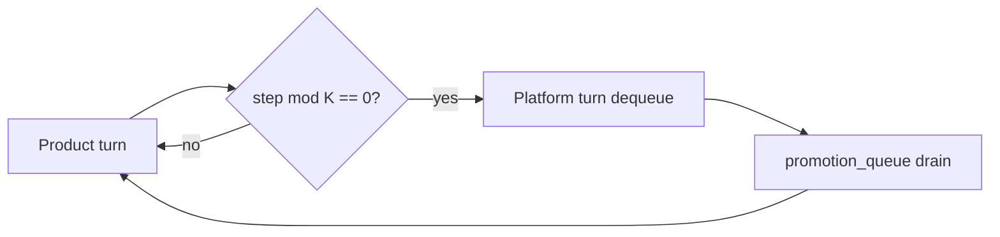

<!-- Complete pass 3 2026-06-28 SEC-15 -->

# SEC-15: v2.16 release v2 16 platform queue scheduler

**Parent:** — · **Branch SEC** · **Vision §15** · **Release:** v2.16

## Reader narrative
<!-- prose-source: agent meta 2026-06-28 -->

Release v2.16 introduces the platform promotion queue in state and a scheduler that processes one improvement item every K project steps. Delivery and self-improvement run on an interleaved schedule so the current goal keeps moving while the improvement backlog still makes steady progress—this release encodes that bargain in data structures and autopilot scheduling.

Task cards gain Components/Promotion notes so workers know when they must compose from catalog or enqueue promotion work.

## Purpose

SEC-15-v2.16 defines release v2 16 platform queue scheduler for the agent-driven expert system. Roadmap, gap analysis, pursuit flow, decisions.
## Scope

- Owns `SEC-15-v2.16` only; siblings under `SEC-15-v2` must not duplicate this spec.
- Aligns with minimal HITL: H1 plan, H2 blocker, H3 sign-off ([INTRO-1.2](INTRO-1.2-human-touchpoint-contract-h1-h2-h3.md)).
- Conflicts resolve in favor of [Vision §15 — Implementation roadmap (additive v2 releases)](../../full-automation-vision-and-hierarchy.md#15-implementation-roadmap-additive-v2-releases).

```
SEC-15-v2.16 release v2 16 platform queue scheduler
```
## Behavior / step logic
<!-- timeline-source: agent cli-composer-2.5 2026-06-28 -->

1. `run-local-pipeline.py` polls `state.json` on an operator-configured interval; each wake runs [A2.1](A2.1-preflight-check-pipeline-blocked-extended.md) via S0 before invoking the Cursor SDK agent with genius-tier model from [J1](J1-model-policy.md).
2. On READY, the daemon executes exactly one [A2.2](A2.2-if-ready-execute-one-pipeline-step.md) pursuit phase identical to in-IDE autopilot—no chat memory, only committed journal/state from Plane H.
3. On BLOCKED (H2, budget, integrity), the daemon sleeps until the next poll or operator unblocks; it does not retry the same phase without a fresh preflight pass.
4. Goal autopilot semantics apply without [A3.1](A3.1-session-autopilot-max-steps-per-session.md) session caps—24/7 unattended pursuit on the operator PC requires `cursor-sdk` and `CURSOR_API_KEY` per [I2.1](I2.1-runtime-sdk-run-local-pipeline-goal-autopilot.md).
5. After laptop sleep or crash, the daemon resumes from the last dual-write snapshot—not SDK chat history—and pairs with [A6.2](A6.2-notify-digest-on-h2-blocker-not-every-step.md) for H2 digests; if auth fails, pursuit halts at H2 with a typed integration stop.



## JSON example

```json
{
  "node": "SEC-15-v2.16",
  "description": "release v2 16 platform queue scheduler",
  "state": { "ref": "APP-B-state-json-sketch.md" },
  "implemented_in_release": "v2.14+"
}
```


## State / data fields

| Field | Type | Description |
|-------|------|-------------|
| `platform.promotion_queue` | array | Promotion items FIFO with priority overrides |

## Repo artifacts (this branch)


## Edge cases

- Operator closes laptop mid-loop — state.json must resume from last good dual-write.
- Concurrent manual edit to queue JSON — conductor reloads queue each wake; last writer wins with journal note.
- Edge case `SEC-15-v2.16` variant 3: verify state dual-write before continuing pursuit.
- Edge case `SEC-15-v2.16` variant 4: verify state dual-write before continuing pursuit.
- Pass 3: add regression test or evidence path specific to `SEC-15-v2.16`.
- Pass 3: cross-link related nodes in same branch index.

## Failure modes

- **Silent stop:** Agent ends turn without updating queue → mitigated by /loop + check-hierarchy-queue.py EMPTY gate.
- **False complete:** Item marked done without artifact → audit-hierarchy-depth.py re-enqueues deepen pass.
- **Scope bleed:** Worker edits journal/state during planning-only expansion → forbidden in vision-expansion-prompt.
- **Stale design:** Upstream vision § changes → reconcile-stale adds deepen items for affected ids.

## Concrete implementation

1. Map `SEC-15-v2.16` to v2.14–v2.23 release row in SEC-15-index.md.
2. Create or extend S0 script if behavior is file-derived.
3. Add unit test under tests/unit/test_sec-15-v2_16.py when script exists.
4. Validate `SEC-15-v2.16` against SEC-15 release checklist and parent index links.
5. Document `SEC-15-v2.16` in parent index with verify command and release tag.
6. Add checklist row in SEC-15 release doc for `SEC-15-v2.16`.

## Release deliverables (SEC-15)

- Schema: additive `state.json` fields only
- Scripts: S0 tools for SEC-15-v2.16
- Skills/tests/docs per vision roadmap row

## Verification

| Check | Command |
|-------|---------|
| Completeness | `python scripts/automation/audit-hierarchy-depth.py --strict --ids SEC-15-v2.16` |
| Conformance | `python scripts/validate-workflow.py` |
| Task evidence | `python scripts/verify-router.py` when implement task exists |

## Dependencies

| Link | Why |
|------|-----|
| [full-automation-vision-and-hierarchy.md](../../full-automation-vision-and-hierarchy.md) §15 | Master hierarchy |
| [SEC-15-v2-index](SEC-15-v2-index.md) | Parent grouping |
| [genius-conductor-tiered-routing.md](../../genius-conductor-tiered-routing.md) | S0–S4 routing |

## Acceptance criteria

- [ ] `python scripts/automation/audit-hierarchy-depth.py --strict --ids SEC-15-v2.16` passes
- [ ] Named script, skill, or test path exists or is listed in SEC-15 release row
- [ ] Linked from [SEC-15-v2-index](SEC-15-v2-index.md)
- [ ] `python scripts/validate-workflow.py` passes after implement

## Cross-links

- [hierarchy-expander SKILL](../../../.cursor/skills/hierarchy-expander/SKILL.md)
