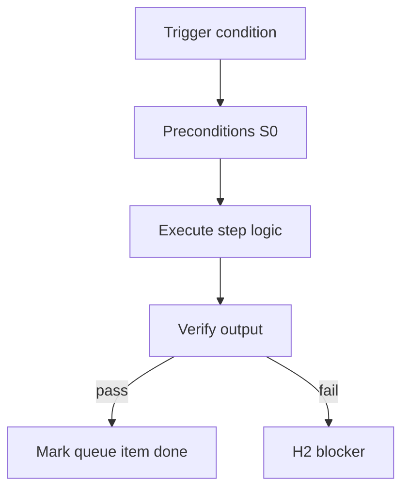

<!-- Complete pass 3 2026-06-28 SEC-15 -->

# SEC-15: v2.17 release v2 17 catalog compose first list components

**Parent:** — · **Branch SEC** · **Vision §15** · **Release:** v2.17

## Reader narrative
<!-- prose-source: agent meta 2026-06-28 -->

Release v2.17 ships catalog discovery and compose-first enforcement: list-components.py generates docs/platform/CATALOG.md, librarian suggests components, and rules require composition before S1+ invention.

This release reduces duplicate tooling and scope creep—Plane E becomes operational, not aspirational.

## Purpose

SEC-15-v2.17 defines release v2 17 catalog compose first list components for the agent-driven expert system. Roadmap, gap analysis, pursuit flow, decisions.
## Scope

- Owns `SEC-15-v2.17` only; siblings under `SEC-15-v2` must not duplicate this spec.
- Aligns with minimal HITL: H1 plan, H2 blocker, H3 sign-off ([INTRO-1.2](INTRO-1.2-human-touchpoint-contract-h1-h2-h3.md)).
- Conflicts resolve in favor of [Vision §15 — Implementation roadmap (additive v2 releases)](../../full-automation-vision-and-hierarchy.md#15-implementation-roadmap-additive-v2-releases).

```
SEC-15-v2.17 release v2 17 catalog compose first list components
```
## Behavior / step logic
<!-- timeline-source: agent cli-composer-2.5 2026-06-28 -->

1. At H1 plan approval for a new repo, route-tier or program-scoper sets `pipeline_id` to `software-greenfield` and seeds state.json with the first phase skill as `next_action` (typically spec-parser).
2. Each pursuit turn runs [A2.1](A2.1-preflight-check-pipeline-blocked-extended.md) preflight then exactly one greenfield phase per [A2.2](A2.2-if-ready-execute-one-pipeline-step.md)—spec-parser → hld-writer → dd-writer → diagrams → task-breakdown → scaffold → implement loop—skipping phases the journal already marks complete.
3. Self-gate and evidence gates apply after H1 unless [J3](J3-strict-hitl.md) strict HITL overrides; implement tasks require verifier evidence before `last_verify=passed` advances the loop.
4. Consumer goals from [A1.1](A1.1-goal-id-parent-goal-goal-type.md) attach to greenfield phases via task cards and `next_action`; scope completion triggers [A2.4](A2.4-goal-scope-complete-run-goal-verify.md) rather than arbitrary phase skipping.
5. If `pipeline_id` mismatches repo state, a phase runs out of order, or evidence is missing before advance, pursuit halts at H2 until the conductor dual-writes corrected journal sequencing and state.json routing.



## JSON example

```json
{
  "node": "SEC-15-v2.17",
  "description": "release v2 17 catalog compose first list components",
  "state": { "ref": "APP-B-state-json-sketch.md" },
  "implemented_in_release": "v2.14+"
}
```


## Repo artifacts (this branch)


## Edge cases

- Operator closes laptop mid-loop — state.json must resume from last good dual-write.
- Concurrent manual edit to queue JSON — conductor reloads queue each wake; last writer wins with journal note.
- Edge case `SEC-15-v2.17` variant 3: verify state dual-write before continuing pursuit.
- Edge case `SEC-15-v2.17` variant 4: verify state dual-write before continuing pursuit.
- Pass 3: add regression test or evidence path specific to `SEC-15-v2.17`.
- Pass 3: cross-link related nodes in same branch index.

## Failure modes

- **Silent stop:** Agent ends turn without updating queue → mitigated by /loop + check-hierarchy-queue.py EMPTY gate.
- **False complete:** Item marked done without artifact → audit-hierarchy-depth.py re-enqueues deepen pass.
- **Scope bleed:** Worker edits journal/state during planning-only expansion → forbidden in vision-expansion-prompt.
- **Stale design:** Upstream vision § changes → reconcile-stale adds deepen items for affected ids.

## Concrete implementation

1. Map `SEC-15-v2.17` to v2.14–v2.23 release row in SEC-15-index.md.
2. Create or extend S0 script if behavior is file-derived.
3. Add unit test under tests/unit/test_sec-15-v2_17.py when script exists.
4. Validate `SEC-15-v2.17` against SEC-15 release checklist and parent index links.
5. Document `SEC-15-v2.17` in parent index with verify command and release tag.
6. Add checklist row in SEC-15 release doc for `SEC-15-v2.17`.

## Release deliverables (SEC-15)

- Schema: additive `state.json` fields only
- Scripts: S0 tools for SEC-15-v2.17
- Skills/tests/docs per vision roadmap row

## Verification

| Check | Command |
|-------|---------|
| Completeness | `python scripts/automation/audit-hierarchy-depth.py --strict --ids SEC-15-v2.17` |
| Conformance | `python scripts/validate-workflow.py` |
| Task evidence | `python scripts/verify-router.py` when implement task exists |

## Dependencies

| Link | Why |
|------|-----|
| [full-automation-vision-and-hierarchy.md](../../full-automation-vision-and-hierarchy.md) §15 | Master hierarchy |
| [SEC-15-v2-index](SEC-15-v2-index.md) | Parent grouping |
| [genius-conductor-tiered-routing.md](../../genius-conductor-tiered-routing.md) | S0–S4 routing |

## Acceptance criteria

- [ ] `python scripts/automation/audit-hierarchy-depth.py --strict --ids SEC-15-v2.17` passes
- [ ] Named script, skill, or test path exists or is listed in SEC-15 release row
- [ ] Linked from [SEC-15-v2-index](SEC-15-v2-index.md)
- [ ] `python scripts/validate-workflow.py` passes after implement

## Cross-links

- [hierarchy-expander SKILL](../../../.cursor/skills/hierarchy-expander/SKILL.md)
