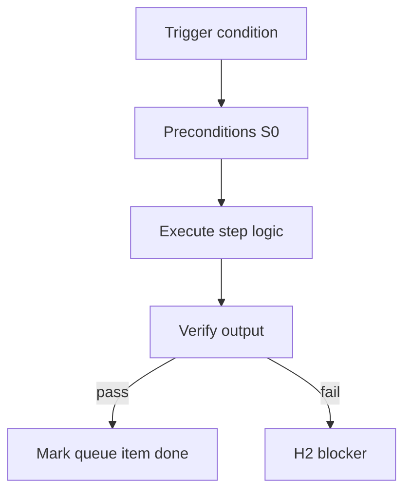

<!-- Complete pass 3 2026-06-28 SEC-15 -->

# SEC-15: v2.18 release v2 18 staleness graph platform nodes

**Parent:** — · **Branch SEC** · **Vision §15** · **Release:** v2.18

## Reader narrative
<!-- prose-source: agent meta 2026-06-28 -->

Release v2.18 extends staleness and artifact graphs to platform nodes so design changes ripple to dependent scripts, playbooks, and pack fragments. Reconcile-stale must see platform promotions—not only product design docs.

Without this, platform queue items can promote obsolete patterns into the catalog.

## Purpose

SEC-15-v2.18 defines release v2 18 staleness graph platform nodes for the agent-driven expert system. Roadmap, gap analysis, pursuit flow, decisions.
## Scope

- Owns `SEC-15-v2.18` only; siblings under `SEC-15-v2` must not duplicate this spec.
- Aligns with minimal HITL: H1 plan, H2 blocker, H3 sign-off ([INTRO-1.2](INTRO-1.2-human-touchpoint-contract-h1-h2-h3.md)).
- Conflicts resolve in favor of [Vision §15 — Implementation roadmap (additive v2 releases)](../../full-automation-vision-and-hierarchy.md#15-implementation-roadmap-additive-v2-releases).

```
SEC-15-v2.18 release v2 18 staleness graph platform nodes
```
## Behavior / step logic
<!-- timeline-source: agent cli-composer-2.5 2026-06-28 -->

1. Reconcile-stale must see platform promotions—not only product design docs
2. Without this, platform queue items can promote obsolete patterns into the catalog
3. This section documents cross-cutting architecture: pursuit flow, migration gaps, or release sequencing for the expert system.
4. Implementers treat SEC rows as program backlog ordering, not as ad hoc prose.
5. Release slices (SEC-15) map harness versions to shippable capability bundles.



## JSON example

```json
{
  "node": "SEC-15-v2.18",
  "description": "release v2 18 staleness graph platform nodes",
  "state": { "ref": "APP-B-state-json-sketch.md" },
  "implemented_in_release": "v2.14+"
}
```


## Repo artifacts (this branch)


## Edge cases

- Operator closes laptop mid-loop — state.json must resume from last good dual-write.
- Concurrent manual edit to queue JSON — conductor reloads queue each wake; last writer wins with journal note.
- Edge case `SEC-15-v2.18` variant 3: verify state dual-write before continuing pursuit.
- Edge case `SEC-15-v2.18` variant 4: verify state dual-write before continuing pursuit.
- Pass 3: add regression test or evidence path specific to `SEC-15-v2.18`.
- Pass 3: cross-link related nodes in same branch index.

## Failure modes

- **Silent stop:** Agent ends turn without updating queue → mitigated by /loop + check-hierarchy-queue.py EMPTY gate.
- **False complete:** Item marked done without artifact → audit-hierarchy-depth.py re-enqueues deepen pass.
- **Scope bleed:** Worker edits journal/state during planning-only expansion → forbidden in vision-expansion-prompt.
- **Stale design:** Upstream vision § changes → reconcile-stale adds deepen items for affected ids.

## Concrete implementation

1. Map `SEC-15-v2.18` to v2.14–v2.23 release row in SEC-15-index.md.
2. Create or extend S0 script if behavior is file-derived.
3. Add unit test under tests/unit/test_sec-15-v2_18.py when script exists.
4. Validate `SEC-15-v2.18` against SEC-15 release checklist and parent index links.
5. Document `SEC-15-v2.18` in parent index with verify command and release tag.
6. Add checklist row in SEC-15 release doc for `SEC-15-v2.18`.

## Release deliverables (SEC-15)

- Schema: additive `state.json` fields only
- Scripts: S0 tools for SEC-15-v2.18
- Skills/tests/docs per vision roadmap row

## Verification

| Check | Command |
|-------|---------|
| Completeness | `python scripts/automation/audit-hierarchy-depth.py --strict --ids SEC-15-v2.18` |
| Conformance | `python scripts/validate-workflow.py` |
| Task evidence | `python scripts/verify-router.py` when implement task exists |

## Dependencies

| Link | Why |
|------|-----|
| [full-automation-vision-and-hierarchy.md](../../full-automation-vision-and-hierarchy.md) §15 | Master hierarchy |
| [SEC-15-v2-index](SEC-15-v2-index.md) | Parent grouping |
| [genius-conductor-tiered-routing.md](../../genius-conductor-tiered-routing.md) | S0–S4 routing |

## Acceptance criteria

- [ ] `python scripts/automation/audit-hierarchy-depth.py --strict --ids SEC-15-v2.18` passes
- [ ] Named script, skill, or test path exists or is listed in SEC-15 release row
- [ ] Linked from [SEC-15-v2-index](SEC-15-v2-index.md)
- [ ] `python scripts/validate-workflow.py` passes after implement

## Cross-links

- [hierarchy-expander SKILL](../../../.cursor/skills/hierarchy-expander/SKILL.md)
