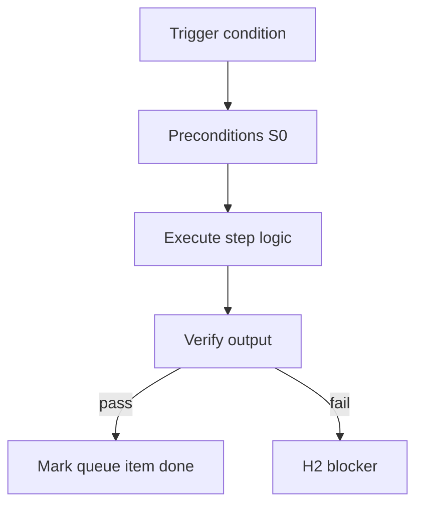

<!-- Complete pass 3 2026-06-28 SEC-15 -->

# SEC-15: v2.20 release v2 20 game studio pack reference

**Parent:** — · **Branch SEC** · **Vision §15** · **Release:** v2.20

## Reader narrative
<!-- prose-source: agent meta 2026-06-28 -->

Release v2.20 delivers a game studio pack reference implementation with an end-to-end demo that uses only H1 and H3 as human touchpoints. It proves the taxonomy and pursuit loop on a creative-industry shape, not only software CRUD.

Success is a reproducible demo script plus goal_verify evidence, not a slide deck.

## Purpose

SEC-15-v2.20 defines release v2 20 game studio pack reference for the agent-driven expert system. Roadmap, gap analysis, pursuit flow, decisions.
## Scope

- Owns `SEC-15-v2.20` only; siblings under `SEC-15-v2` must not duplicate this spec.
- Aligns with minimal HITL: H1 plan, H2 blocker, H3 sign-off ([INTRO-1.2](INTRO-1.2-human-touchpoint-contract-h1-h2-h3.md)).
- Conflicts resolve in favor of [Vision §15 — Implementation roadmap (additive v2 releases)](../../full-automation-vision-and-hierarchy.md#15-implementation-roadmap-additive-v2-releases).

```
SEC-15-v2.20 release v2 20 game studio pack reference
```
## Behavior / step logic
<!-- timeline-source: agent cursor-agent 2026-06-28 -->

1. v2.20 pursuit binds a game-studio template-pack ([F3](F3-index.md)) with roles, pipelines, and external tool permissions so a creative-industry demo runs through the same A2 loop as software greenfield.
2. Demo goals use only H1 plan approval and H3 sign-off per [INTRO-1.2](INTRO-1.2-human-touchpoint-contract-h1-h2-h3.md)—Blender, UE, git, and CI tool phases execute via economy workers with evidence, not standing human babysitting.
3. Success criteria include reproducible demo script output plus goal_verify evidence ([F3.4](F3.4-game-studio-goal-verify-asset-engine-tests-perf.md)) aggregating asset checks, engine tests, or perf gates—not slide decks or manual looks-good sign-off.
4. The reference pack proves taxonomy and pursuit on non-CRUD work: the conductor still runs one [A2.2](A2.2-if-ready-execute-one-pipeline-step.md) phase per wake with pack-defined pipelines from [F1.3](F1.3-pack-pipelines---yaml.md).
5. If demo evidence is missing or external tool MCP calls fail, pursuit stops at H2 with tool-operator logs attached—release acceptance requires green goal_verify, not partial asset delivery.



## JSON example

```json
{
  "node": "SEC-15-v2.20",
  "description": "release v2 20 game studio pack reference",
  "state": { "ref": "APP-B-state-json-sketch.md" },
  "implemented_in_release": "v2.14+"
}
```


## Repo artifacts (this branch)


## Edge cases

- Operator closes laptop mid-loop — state.json must resume from last good dual-write.
- Concurrent manual edit to queue JSON — conductor reloads queue each wake; last writer wins with journal note.
- Edge case `SEC-15-v2.20` variant 3: verify state dual-write before continuing pursuit.
- Edge case `SEC-15-v2.20` variant 4: verify state dual-write before continuing pursuit.
- Pass 3: add regression test or evidence path specific to `SEC-15-v2.20`.
- Pass 3: cross-link related nodes in same branch index.

## Failure modes

- **Silent stop:** Agent ends turn without updating queue → mitigated by /loop + check-hierarchy-queue.py EMPTY gate.
- **False complete:** Item marked done without artifact → audit-hierarchy-depth.py re-enqueues deepen pass.
- **Scope bleed:** Worker edits journal/state during planning-only expansion → forbidden in vision-expansion-prompt.
- **Stale design:** Upstream vision § changes → reconcile-stale adds deepen items for affected ids.

## Concrete implementation

1. Map `SEC-15-v2.20` to v2.14–v2.23 release row in SEC-15-index.md.
2. Create or extend S0 script if behavior is file-derived.
3. Add unit test under tests/unit/test_sec-15-v2_20.py when script exists.
4. Validate `SEC-15-v2.20` against SEC-15 release checklist and parent index links.
5. Document `SEC-15-v2.20` in parent index with verify command and release tag.
6. Add checklist row in SEC-15 release doc for `SEC-15-v2.20`.

## Release deliverables (SEC-15)

- Schema: additive `state.json` fields only
- Scripts: S0 tools for SEC-15-v2.20
- Skills/tests/docs per vision roadmap row

## Verification

| Check | Command |
|-------|---------|
| Completeness | `python scripts/automation/audit-hierarchy-depth.py --strict --ids SEC-15-v2.20` |
| Conformance | `python scripts/validate-workflow.py` |
| Task evidence | `python scripts/verify-router.py` when implement task exists |

## Dependencies

| Link | Why |
|------|-----|
| [full-automation-vision-and-hierarchy.md](../../full-automation-vision-and-hierarchy.md) §15 | Master hierarchy |
| [SEC-15-v2-index](SEC-15-v2-index.md) | Parent grouping |
| [genius-conductor-tiered-routing.md](../../genius-conductor-tiered-routing.md) | S0–S4 routing |

## Acceptance criteria

- [ ] `python scripts/automation/audit-hierarchy-depth.py --strict --ids SEC-15-v2.20` passes
- [ ] Named script, skill, or test path exists or is listed in SEC-15 release row
- [ ] Linked from [SEC-15-v2-index](SEC-15-v2-index.md)
- [ ] `python scripts/validate-workflow.py` passes after implement

## Cross-links

- [hierarchy-expander SKILL](../../../.cursor/skills/hierarchy-expander/SKILL.md)
