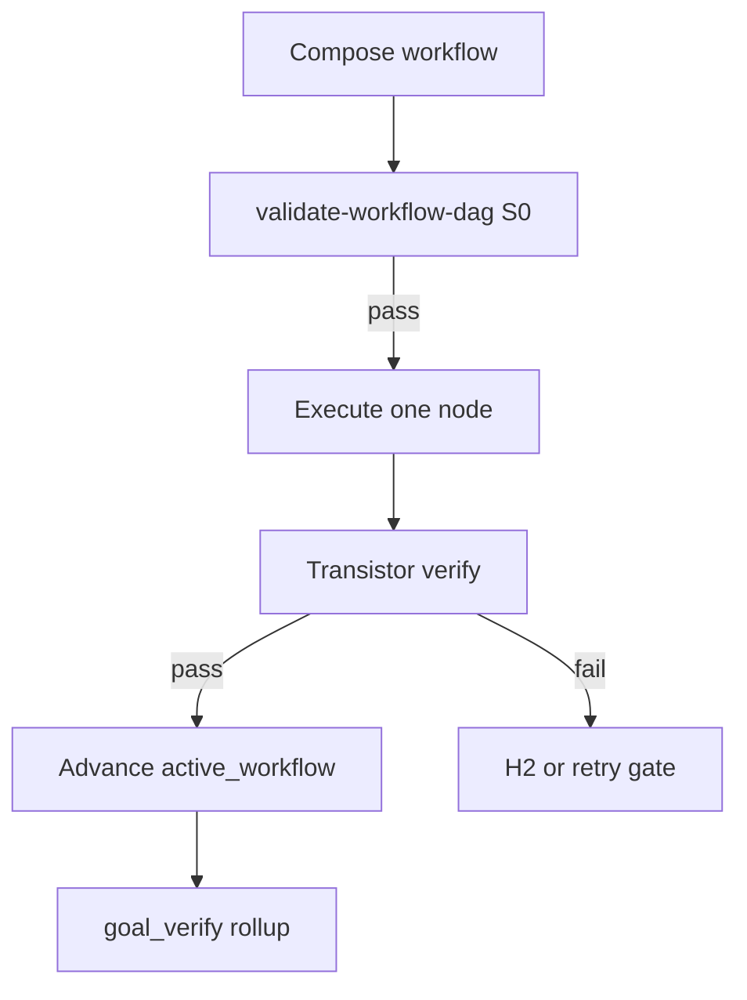

<!-- Complete pass 1 2026-06-28 SEC-15-v2.28 -->

# SEC-15-v2.28: Release v2.28 transistor maturity dashboard metrics

**Parent:** [SEC-15-index](SEC-15-index.md) · **Branch SEC** · **Vision §19** · **Release:** v2.28

## Reader narrative
<!-- prose-source: agent transistor-expansion 2026-06-28 -->

Operator polish: dashboard hard/soft/gate ratio, fuzzy-chain incident count, promotion debt by capability, workflow coverage percent per pack. Optional workflow DAG viewer in docs/platform/.

See [Vision §19 — Transistor & generator workflow model](../../full-automation-vision-and-hierarchy.md#transistor--generator-workflow-model) and [SEC-18-transistor-model-a-to-z](SEC-18-transistor-model-a-to-z.md).

## Purpose

SEC-15-v2.28 defines release v2.28 transistor maturity dashboard metrics for the agent-driven expert system. Transistor & generator workflow model (§19).
## Scope

- Owns `SEC-15-v2.28` only; siblings under `SEC-15` must not duplicate this spec.
- Aligns with minimal HITL: H1 plan, H2 blocker, H3 sign-off ([INTRO-1.2](INTRO-1.2-human-touchpoint-contract-h1-h2-h3.md)).
- Conflicts resolve in favor of [Vision §15 — Implementation roadmap (additive v2 releases)](../../full-automation-vision-and-hierarchy.md#15-implementation-roadmap-additive-v2-releases).

```
│   └── SEC-15-v2.28 Release v2.28 transistor maturity dashboard metrics
```
## Behavior / step logic
<!-- timeline-source: agent transistor-expansion 2026-06-28 -->

1. generate-dashboard.py adds transistor metrics section.
2. G5.8 fuzzy-chain counters in state.platform.metrics.
3. Promotion debt SLA alerts when L0 waivers exceed threshold.
4. Optional static HTML DAG viewer from workflow JSON—non-blocking.
5. Closes SEC-18 acceptance checklist for v2.24–v2.28 transistor program.



## JSON example

```json
{
  "node": "SEC-15-v2.28",
  "description": "release v2.28 transistor maturity dashboard metrics",
  "state": { "ref": "APP-B-state-json-sketch.md", "active_workflow": "H1.7" },
  "implemented_in_release": "v2.28+"
}
```

## Repo artifacts (this branch)

- `docs/platform/transistors/`
- `docs/platform/schemas/transistor.v1.json`
- `docs/platform/schemas/workflow-dag.v1.json`
- `docs/workflows/`
- `scripts/automation/list-transistors.py`
- `scripts/automation/validate-workflow-dag.py`

## Release deliverables (SEC-15)

- Schema: additive `state.json` and workflow/transistor schemas
- Scripts: S0 tools listed in behavior steps
- Skills/tests/docs per SEC-18 roadmap row

## Edge cases

- Operator closes laptop mid-loop — state.json must resume from last good dual-write including active_workflow.
- Transistor version bump mid-pursuit — E5.4 marks workflow stale; re-validate before next node.
- L0 waiver node without promotion progress — D3.3 priority boost then H2 if threshold exceeded.
- Pack overlay id collision — F5.4 semver fork per D5.3, not silent overwrite.
- Parallel branch join missing typed input — validate-workflow-dag fails at compose time.

## Failure modes

- **Fuzzy chain:** Implement without workflow_node_id when C6.1 applies → G5.8 blocks at preflight.
- **False complete:** Node marked done without transistor verify evidence → G2.5 goal_verify fails closed.
- **Stale workflow:** active_workflow.validation_hash mismatch → E5.4 reconcile before advance.
- **Duplicate transistor:** G5.6 list-transistors --check-duplicates rejects promotion.
- **Scope bleed:** Worker runs transistors outside bound node → C6.3 conformance failure.

## Concrete implementation

1. Map `SEC-15-v2.28` to release row in [SEC-15-index](SEC-15-index.md) (v2.28).
2. Implement behavior per [SEC-18](SEC-18-transistor-model-a-to-z.md) acceptance checklist.
3. Add or extend S0 script when behavior is file-derived.
4. Add unit test under `tests/unit/` when script exists.
5. Link from [SEC-15-index](SEC-15-index.md).
6. Run `python scripts/validate-workflow.py` after implement.

## Verification

| Check | Command |
|-------|---------|
| Completeness | `python scripts/automation/audit-hierarchy-depth.py --strict --ids SEC-15-v2.28` |
| Conformance | `python scripts/validate-workflow.py` |
| DAG validity | `python scripts/automation/validate-workflow-dag.py` when workflow exists |
| Task evidence | `python scripts/verify-router.py` when implement task exists |

## Dependencies

| Link | Why |
|------|-----|
| [SEC-18-transistor-model-a-to-z](SEC-18-transistor-model-a-to-z.md) | A–Z authority |
| [full-automation-vision-and-hierarchy.md](../../full-automation-vision-and-hierarchy.md) §19 | Master hierarchy |
| [SEC-15-index](SEC-15-index.md) | Parent grouping |
| [genius-conductor-tiered-routing.md](../../genius-conductor-tiered-routing.md) | S0–S4 routing |

## Acceptance criteria

- [ ] `python scripts/automation/audit-hierarchy-depth.py --strict --ids SEC-15-v2.28` passes
- [ ] Named script, skill, or test path exists or is listed in SEC-15 release row
- [ ] Linked from [SEC-15-index](SEC-15-index.md)
- [ ] Aligned with SEC-18 transistor model
- [ ] `python scripts/validate-workflow.py` passes after implement

## Cross-links

- [hierarchy-expander SKILL](../../../.cursor/skills/hierarchy-expander/SKILL.md)
- [INTRO-2-transistor-building-blocks-north-star](INTRO-2-transistor-building-blocks-north-star.md)
