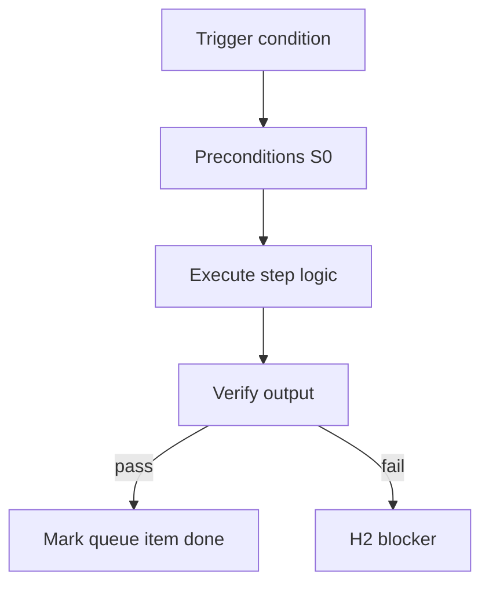

<!-- Complete pass 3 2026-06-28 SEC-17-1 -->

# SEC-17-1: Decision self-gate rigor checklist vs reviewer

**Parent:** — · **Branch SEC** · **Vision §17** · **Release:** meta

## Reader narrative
<!-- prose-source: agent meta 2026-06-28 -->

Open decision: how rigorous should middle design gates be when strict_hitl is off? Options span checklist-only self-gate, automated LLM reviewer, or second economy reviewer. The choice affects cost, latency, and mistake rates for HLD/DD/manifest phases.

Record the decision as an ADR when made; until then, implementers should default to checklist + evidence paths that goal_verify can audit.

## Purpose

SEC-17-1 defines decision self gate rigor checklist vs reviewer for the agent-driven expert system. Roadmap, gap analysis, pursuit flow, decisions.
## Scope

- Owns `SEC-17-1` only; siblings under `—` must not duplicate this spec.
- Aligns with minimal HITL: H1 plan, H2 blocker, H3 sign-off ([INTRO-1.2](INTRO-1.2-human-touchpoint-contract-h1-h2-h3.md)).
- Conflicts resolve in favor of [Vision §17 — Open design decisions](../../full-automation-vision-and-hierarchy.md#17-open-design-decisions).

```
SEC-17-1 decision self gate rigor checklist vs reviewer
```
## Behavior / step logic
<!-- timeline-source: agent cli-composer-2.5 2026-06-28 -->

1. When [B5.1](B5.1-active-role-from-template-pack.md) sets `active_role`, S0 resolves role bindings from pack `roles.yaml`—pipeline_id, enabled skills, MCP servers, and forbidden paths—and merges operator overrides from `model-policy.json` into pursuit state.
2. Before [A2.2](A2.2-if-ready-execute-one-pipeline-step.md), route-tier reads `pipeline_id` from the active role so implement work cannot route into design-only phases; a platform role may invoke promotion-queue skills while a product role cannot waive governance gates.
3. Worker spawn contracts under [B2.3](B2.3-phase-workers-implement-design-explore.md) inherit only the active role's skill allowlist and MCP/CLI permissions per [F6.3](F6.3-role-tool-permissions-mcp-cli-allowlist.md)—forbidden paths block reads even when workers are economy tier.
4. At pack instantiation ([F2.1](F2.1-company-instantiate-program-scoper-pack-select.md)), conformance scripts validate that each role's pipeline_id exists in the [C1](C1-index.md) registry and that skill bindings stay within tool permissions before the pack publishes.
5. If role bindings drift after manual policy edits or reference an unknown pipeline_id, [A2.1](A2.1-preflight-check-pipeline-blocked-extended.md) halts at H2 until operators reconcile pack schema and state.json—never advancing implement with ambiguous routing.



## JSON example

```json
{
  "node": "SEC-17-1",
  "description": "decision self gate rigor checklist vs reviewer",
  "state": { "ref": "APP-B-state-json-sketch.md" },
  "implemented_in_release": "v2.14+"
}
```


## Repo artifacts (this branch)


## Edge cases

- Operator closes laptop mid-loop — state.json must resume from last good dual-write.
- Concurrent manual edit to queue JSON — conductor reloads queue each wake; last writer wins with journal note.
- Edge case `SEC-17-1` variant 3: verify state dual-write before continuing pursuit.
- Edge case `SEC-17-1` variant 4: verify state dual-write before continuing pursuit.
- Pass 3: add regression test or evidence path specific to `SEC-17-1`.
- Pass 3: cross-link related nodes in same branch index.

## Failure modes

- **Silent stop:** Agent ends turn without updating queue → mitigated by /loop + check-hierarchy-queue.py EMPTY gate.
- **False complete:** Item marked done without artifact → audit-hierarchy-depth.py re-enqueues deepen pass.
- **Scope bleed:** Worker edits journal/state during planning-only expansion → forbidden in vision-expansion-prompt.
- **Stale design:** Upstream vision § changes → reconcile-stale adds deepen items for affected ids.

## Concrete implementation

1. Map `SEC-17-1` to v2.14–v2.23 release row in SEC-15-index.md.
2. Create or extend S0 script if behavior is file-derived.
3. Add unit test under tests/unit/test_sec-17-1.py when script exists.
4. Validate `SEC-17-1` against SEC-15 release checklist and parent index links.
5. Document `SEC-17-1` in parent index with verify command and release tag.
6. Add checklist row in SEC-15 release doc for `SEC-17-1`.

## Verification

| Check | Command |
|-------|---------|
| Completeness | `python scripts/automation/audit-hierarchy-depth.py --strict --ids SEC-17-1` |
| Conformance | `python scripts/validate-workflow.py` |
| Task evidence | `python scripts/verify-router.py` when implement task exists |

## Dependencies

| Link | Why |
|------|-----|
| [full-automation-vision-and-hierarchy.md](../../full-automation-vision-and-hierarchy.md) §17 | Master hierarchy |
| [—-index](—-index.md) | Parent grouping |
| [genius-conductor-tiered-routing.md](../../genius-conductor-tiered-routing.md) | S0–S4 routing |

## Acceptance criteria

- [ ] `python scripts/automation/audit-hierarchy-depth.py --strict --ids SEC-17-1` passes
- [ ] Named script, skill, or test path exists or is listed in SEC-15 release row
- [ ] Linked from [—-index](—-index.md)
- [ ] `python scripts/validate-workflow.py` passes after implement

## Cross-links

- [hierarchy-expander SKILL](../../../.cursor/skills/hierarchy-expander/SKILL.md)
