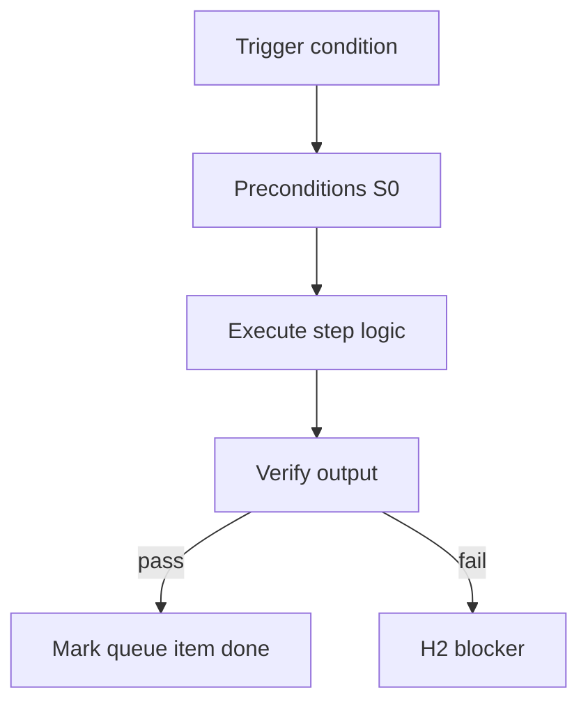

<!-- Complete pass 3 2026-06-28 SEC-17-2 -->

# SEC-17-2: Decision H3 scope task milestone release company

**Parent:** — · **Branch SEC** · **Vision §17** · **Release:** meta

## Reader narrative
<!-- prose-source: agent meta 2026-06-28 -->

Open decision: what granularity triggers H3? Per task, milestone, release, or company-level goal? Finer H3 increases operator load; coarser H3 increases blast radius of acceptance.

Pack authors should declare H3 scope in company.yaml so pursuit knows when to request sign-off.

## Purpose

SEC-17-2 defines decision h3 scope task milestone release company for the agent-driven expert system. Roadmap, gap analysis, pursuit flow, decisions.
## Scope

- Owns `SEC-17-2` only; siblings under `—` must not duplicate this spec.
- Aligns with minimal HITL: H1 plan, H2 blocker, H3 sign-off ([INTRO-1.2](INTRO-1.2-human-touchpoint-contract-h1-h2-h3.md)).
- Conflicts resolve in favor of [Vision §17 — Open design decisions](../../full-automation-vision-and-hierarchy.md#17-open-design-decisions).

```
SEC-17-2 decision h3 scope task milestone release company
```
## Behavior / step logic
<!-- timeline-source: agent cli-composer-2.5 2026-06-28 -->

1. When [B5.1](B5.1-active-role-from-template-pack.md) rotates `active_role`, the genius-tier conductor retains orchestration identity—merge authority, routing, and sole journal/state dual-write—while each spawn gets a fresh worker persona with role-scoped `allowed_reads` and tool permissions.
2. Workers execute one phase contract (implement, explore, verifier) and return summaries plus evidence paths; they must not assume conductor persistence across turns or mutate journal/state.json even when the active role name changes mid-pursuit.
3. Role switches update state.json `active_role` and pack-derived skill/tool bindings per [B5.2](B5.2-role-to-pipeline-id-skills-tool-permissions.md) before the next spawn so a platform worker cannot inherit consumer task scope from the prior persona.
4. H2 blocker packaging stays with the conductor at [B1.5](B1.5-s4-governance-escalation-h2-packaging.md)—workers surface blockers in summaries but do not re-prompt the operator directly, preserving centralized HITL discipline across role rotations.
5. If a worker dual-writes journal/state, edits outside role `allowed_reads`, or the conductor implements large task cards inline when `spawn_workers` is true, pursuit fails closed at H2 until role context is reset and dual-write authority is restored to the conductor only.



## JSON example

```json
{
  "node": "SEC-17-2",
  "description": "decision h3 scope task milestone release company",
  "state": { "ref": "APP-B-state-json-sketch.md" },
  "implemented_in_release": "v2.14+"
}
```


## Repo artifacts (this branch)


## Edge cases

- Operator closes laptop mid-loop — state.json must resume from last good dual-write.
- Concurrent manual edit to queue JSON — conductor reloads queue each wake; last writer wins with journal note.
- Edge case `SEC-17-2` variant 3: verify state dual-write before continuing pursuit.
- Edge case `SEC-17-2` variant 4: verify state dual-write before continuing pursuit.
- Pass 3: add regression test or evidence path specific to `SEC-17-2`.
- Pass 3: cross-link related nodes in same branch index.

## Failure modes

- **Silent stop:** Agent ends turn without updating queue → mitigated by /loop + check-hierarchy-queue.py EMPTY gate.
- **False complete:** Item marked done without artifact → audit-hierarchy-depth.py re-enqueues deepen pass.
- **Scope bleed:** Worker edits journal/state during planning-only expansion → forbidden in vision-expansion-prompt.
- **Stale design:** Upstream vision § changes → reconcile-stale adds deepen items for affected ids.

## Concrete implementation

1. Map `SEC-17-2` to v2.14–v2.23 release row in SEC-15-index.md.
2. Create or extend S0 script if behavior is file-derived.
3. Add unit test under tests/unit/test_sec-17-2.py when script exists.
4. Validate `SEC-17-2` against SEC-15 release checklist and parent index links.
5. Document `SEC-17-2` in parent index with verify command and release tag.
6. Add checklist row in SEC-15 release doc for `SEC-17-2`.

## Verification

| Check | Command |
|-------|---------|
| Completeness | `python scripts/automation/audit-hierarchy-depth.py --strict --ids SEC-17-2` |
| Conformance | `python scripts/validate-workflow.py` |
| Task evidence | `python scripts/verify-router.py` when implement task exists |

## Dependencies

| Link | Why |
|------|-----|
| [full-automation-vision-and-hierarchy.md](../../full-automation-vision-and-hierarchy.md) §17 | Master hierarchy |
| [—-index](—-index.md) | Parent grouping |
| [genius-conductor-tiered-routing.md](../../genius-conductor-tiered-routing.md) | S0–S4 routing |

## Acceptance criteria

- [ ] `python scripts/automation/audit-hierarchy-depth.py --strict --ids SEC-17-2` passes
- [ ] Named script, skill, or test path exists or is listed in SEC-15 release row
- [ ] Linked from [—-index](—-index.md)
- [ ] `python scripts/validate-workflow.py` passes after implement

## Cross-links

- [hierarchy-expander SKILL](../../../.cursor/skills/hierarchy-expander/SKILL.md)
