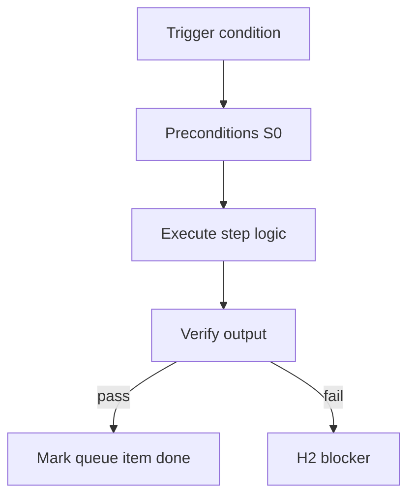

<!-- Complete pass 3 2026-06-28 SEC-17-3 -->

# SEC-17-3: Decision platform K ratio fixed vs adaptive

**Parent:** — · **Branch SEC** · **Vision §17** · **Release:** meta

## Reader narrative
<!-- prose-source: agent meta 2026-06-28 -->

Open decision: platform scheduling ratio—fixed one platform step per K product steps versus adaptive scheduling by queue depth. Fixed ratios are predictable; adaptive ratios respond to promotion backlog pressure.

Simulation on real queue depths should inform the choice before hard-coding K in autopilot.

## Purpose

SEC-17-3 defines decision platform k ratio fixed vs adaptive for the agent-driven expert system. Roadmap, gap analysis, pursuit flow, decisions.
## Scope

- Owns `SEC-17-3` only; siblings under `—` must not duplicate this spec.
- Aligns with minimal HITL: H1 plan, H2 blocker, H3 sign-off ([INTRO-1.2](INTRO-1.2-human-touchpoint-contract-h1-h2-h3.md)).
- Conflicts resolve in favor of [Vision §17 — Open design decisions](../../full-automation-vision-and-hierarchy.md#17-open-design-decisions).

```
SEC-17-3 decision platform k ratio fixed vs adaptive
```
## Behavior / step logic
<!-- timeline-source: agent cursor-agent 2026-06-28 -->

1. During pursuit, [D3.1](D3.1-1-platform-turn-per-k-product-turns.md) decides whether each product turn drains a fixed one-in-K platform slot or uses adaptive scheduling based on promotion backlog depth—a pending SEC-17 decision not yet hard-coded in autopilot.
2. Fixed K ratios make platform-vs-product interleave predictable for operators and cost models; adaptive ratios shift toward Plane D when platform queue depth crosses thresholds per [D3.2](D3.2-priority-boost-queue-depth-threshold.md).
3. Until SEC-17-3 resolves, conductor and S0 schedulers should log queue depth samples so simulation can inform the policy choice before unattended company_autopilot locks a ratio.
4. [B3.4](B3.4-platform-turns-economy-plus-s0-scripts.md) still requires economy platform turns plus S0 scripts regardless of ratio—the decision only affects when platform dequeue competes with product next_action.
5. If adaptive scheduling starves product work or fixed K buries promotion backlog, pursuit surfaces H2 with queue metrics so operators record a Resolved Q&A decision and update pack policy.



## JSON example

```json
{
  "node": "SEC-17-3",
  "description": "decision platform k ratio fixed vs adaptive",
  "state": { "ref": "APP-B-state-json-sketch.md" },
  "implemented_in_release": "v2.14+"
}
```


## Repo artifacts (this branch)


## Edge cases

- Operator closes laptop mid-loop — state.json must resume from last good dual-write.
- Concurrent manual edit to queue JSON — conductor reloads queue each wake; last writer wins with journal note.
- Edge case `SEC-17-3` variant 3: verify state dual-write before continuing pursuit.
- Edge case `SEC-17-3` variant 4: verify state dual-write before continuing pursuit.
- Pass 3: add regression test or evidence path specific to `SEC-17-3`.
- Pass 3: cross-link related nodes in same branch index.

## Failure modes

- **Silent stop:** Agent ends turn without updating queue → mitigated by /loop + check-hierarchy-queue.py EMPTY gate.
- **False complete:** Item marked done without artifact → audit-hierarchy-depth.py re-enqueues deepen pass.
- **Scope bleed:** Worker edits journal/state during planning-only expansion → forbidden in vision-expansion-prompt.
- **Stale design:** Upstream vision § changes → reconcile-stale adds deepen items for affected ids.

## Concrete implementation

1. Map `SEC-17-3` to v2.14–v2.23 release row in SEC-15-index.md.
2. Create or extend S0 script if behavior is file-derived.
3. Add unit test under tests/unit/test_sec-17-3.py when script exists.
4. Validate `SEC-17-3` against SEC-15 release checklist and parent index links.
5. Document `SEC-17-3` in parent index with verify command and release tag.
6. Add checklist row in SEC-15 release doc for `SEC-17-3`.

## Verification

| Check | Command |
|-------|---------|
| Completeness | `python scripts/automation/audit-hierarchy-depth.py --strict --ids SEC-17-3` |
| Conformance | `python scripts/validate-workflow.py` |
| Task evidence | `python scripts/verify-router.py` when implement task exists |

## Dependencies

| Link | Why |
|------|-----|
| [full-automation-vision-and-hierarchy.md](../../full-automation-vision-and-hierarchy.md) §17 | Master hierarchy |
| [—-index](—-index.md) | Parent grouping |
| [genius-conductor-tiered-routing.md](../../genius-conductor-tiered-routing.md) | S0–S4 routing |

## Acceptance criteria

- [ ] `python scripts/automation/audit-hierarchy-depth.py --strict --ids SEC-17-3` passes
- [ ] Named script, skill, or test path exists or is listed in SEC-15 release row
- [ ] Linked from [—-index](—-index.md)
- [ ] `python scripts/validate-workflow.py` passes after implement

## Cross-links

- [hierarchy-expander SKILL](../../../.cursor/skills/hierarchy-expander/SKILL.md)
