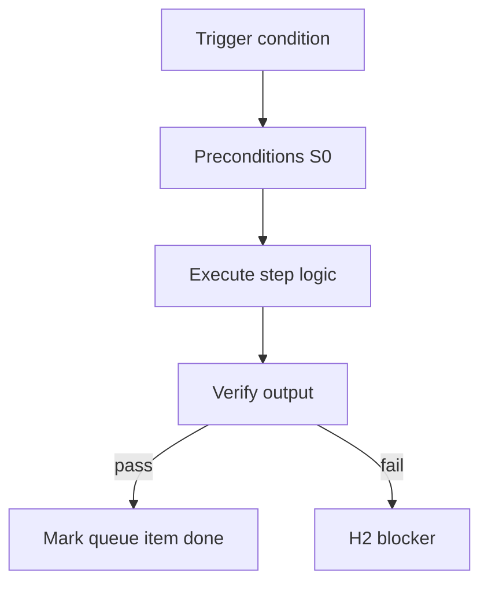

<!-- Complete pass 3 2026-06-28 SEC-17-4 -->

# SEC-17-4: Decision budget caps unlimited vs checkpoint

**Parent:** — · **Branch SEC** · **Vision §17** · **Release:** meta

## Reader narrative
<!-- prose-source: agent meta 2026-06-28 -->

Open decision: budget caps for goal_autopilot—unlimited pursuit versus daily token/step checkpoints. Unlimited pursuit maximizes autonomy; checkpoints protect cost and surface H2 when budgets exhaust.

Budget fields in Plane A interact directly with this decision. Operators need dashboard visibility before choosing unlimited pursuit in production.

## Purpose

SEC-17-4 defines decision budget caps unlimited vs checkpoint for the agent-driven expert system. Roadmap, gap analysis, pursuit flow, decisions.
## Scope

- Owns `SEC-17-4` only; siblings under `—` must not duplicate this spec.
- Aligns with minimal HITL: H1 plan, H2 blocker, H3 sign-off ([INTRO-1.2](INTRO-1.2-human-touchpoint-contract-h1-h2-h3.md)).
- Conflicts resolve in favor of [Vision §17 — Open design decisions](../../full-automation-vision-and-hierarchy.md#17-open-design-decisions).

```
SEC-17-4 decision budget caps unlimited vs checkpoint
```
## Behavior / step logic
<!-- timeline-source: agent cursor-agent 2026-06-28 -->

1. When [A3.2](A3.2-goal-autopilot-until-goal-verify-or-hard-block.md) goal_autopilot is active, [A1.4](A1.4-deadline-budget-steps-tokens-wall-clock.md) budget fields in state.goal govern max steps, tokens, and wall-clock—operators choose unlimited pursuit versus checkpoint caps via this open SEC-17 decision.
2. Each pursuit wake increments budget counters in state.json after [A2.3](A2.3-post-step-route-tier-dual-write-increment.md) dual-write so dashboards and autopilot daemons share the same consumption picture before the next [A2.1](A2.1-preflight-check-pipeline-blocked-extended.md) preflight.
3. Unlimited mode lets goal_autopilot run until goal_verify, a hard [A4](A4-index.md) block, or HITL—without arbitrary daily ceilings beyond operator-approved H1 plan bounds.
4. Checkpoint mode stops pursuit when any budget exhausts and surfaces H2 via [A4.3](A4.3-stop-resource-max-steps-max-cost-lease-expired.md) resource stop taxonomy until the operator resets caps or approves continuation.
5. If budget telemetry is missing or counters desync from journal step counts, pursuit fails closed at H2—never silently continuing goal_autopilot without visibility into cost burn.



## JSON example

```json
{
  "node": "SEC-17-4",
  "description": "decision budget caps unlimited vs checkpoint",
  "state": { "ref": "APP-B-state-json-sketch.md" },
  "implemented_in_release": "v2.14+"
}
```


## Repo artifacts (this branch)


## Edge cases

- Operator closes laptop mid-loop — state.json must resume from last good dual-write.
- Concurrent manual edit to queue JSON — conductor reloads queue each wake; last writer wins with journal note.
- Edge case `SEC-17-4` variant 3: verify state dual-write before continuing pursuit.
- Edge case `SEC-17-4` variant 4: verify state dual-write before continuing pursuit.
- Pass 3: add regression test or evidence path specific to `SEC-17-4`.
- Pass 3: cross-link related nodes in same branch index.

## Failure modes

- **Silent stop:** Agent ends turn without updating queue → mitigated by /loop + check-hierarchy-queue.py EMPTY gate.
- **False complete:** Item marked done without artifact → audit-hierarchy-depth.py re-enqueues deepen pass.
- **Scope bleed:** Worker edits journal/state during planning-only expansion → forbidden in vision-expansion-prompt.
- **Stale design:** Upstream vision § changes → reconcile-stale adds deepen items for affected ids.

## Concrete implementation

1. Map `SEC-17-4` to v2.14–v2.23 release row in SEC-15-index.md.
2. Create or extend S0 script if behavior is file-derived.
3. Add unit test under tests/unit/test_sec-17-4.py when script exists.
4. Validate `SEC-17-4` against SEC-15 release checklist and parent index links.
5. Document `SEC-17-4` in parent index with verify command and release tag.
6. Add checklist row in SEC-15 release doc for `SEC-17-4`.

## Verification

| Check | Command |
|-------|---------|
| Completeness | `python scripts/automation/audit-hierarchy-depth.py --strict --ids SEC-17-4` |
| Conformance | `python scripts/validate-workflow.py` |
| Task evidence | `python scripts/verify-router.py` when implement task exists |

## Dependencies

| Link | Why |
|------|-----|
| [full-automation-vision-and-hierarchy.md](../../full-automation-vision-and-hierarchy.md) §17 | Master hierarchy |
| [—-index](—-index.md) | Parent grouping |
| [genius-conductor-tiered-routing.md](../../genius-conductor-tiered-routing.md) | S0–S4 routing |

## Acceptance criteria

- [ ] `python scripts/automation/audit-hierarchy-depth.py --strict --ids SEC-17-4` passes
- [ ] Named script, skill, or test path exists or is listed in SEC-15 release row
- [ ] Linked from [—-index](—-index.md)
- [ ] `python scripts/validate-workflow.py` passes after implement

## Cross-links

- [hierarchy-expander SKILL](../../../.cursor/skills/hierarchy-expander/SKILL.md)
