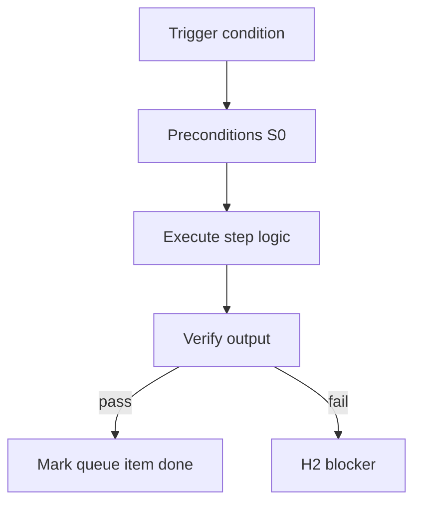

<!-- Complete pass 3 2026-06-28 SEC-17-5 -->

# SEC-17-5: Decision pack authority legal finance H2-always

**Parent:** — · **Branch SEC** · **Vision §17** · **Release:** meta

## Reader narrative
<!-- prose-source: agent meta 2026-06-28 -->

Open decision: can packs mark legal/finance roles as fully automated, or must they always escalate H2? Authority-of-record work may never belong in autonomous pursuit regardless of model capability.

Pack schema should encode role_class with automation_allowed flags once decided.

## Purpose

SEC-17-5 defines decision pack authority legal finance h2 always for the agent-driven expert system. Roadmap, gap analysis, pursuit flow, decisions.
## Scope

- Owns `SEC-17-5` only; siblings under `—` must not duplicate this spec.
- Aligns with minimal HITL: H1 plan, H2 blocker, H3 sign-off ([INTRO-1.2](INTRO-1.2-human-touchpoint-contract-h1-h2-h3.md)).
- Conflicts resolve in favor of [Vision §17 — Open design decisions](../../full-automation-vision-and-hierarchy.md#17-open-design-decisions).

```
SEC-17-5 decision pack authority legal finance h2 always
```
## Behavior / step logic
<!-- timeline-source: agent cursor-agent 2026-06-28 -->

1. Pack roles in [F1.2](F1.2-pack-roles---yaml.md) may declare role_class (e.g., legal, finance) with automation_allowed—until SEC-17-5 resolves whether authority-of-record roles may ever run without H2.
2. When active_role maps to a restricted class, [A2.1](A2.1-preflight-check-pipeline-blocked-extended.md) preflight treats autonomous implement turns as BLOCKED and forces hitl.pending=H2 before contract, filing, or spend actions proceed.
3. [B5.1](B5.1-active-role-from-template-pack.md) role switches into legal or finance lanes require manifest or journal-recorded operator approval even under [A3.3](A3.3-company-autopilot-multi-goal-role-workstreams.md) company autopilot.
4. Economy workers spawned for restricted roles inherit tool allowlists that exclude unsupervised external commits—the conductor cannot waive H2 via Continue alone per [A5.2](A5.2-continue-not-approval-self-gate-h1-h3-only.md).
5. If pack schema omits automation_allowed for a role or contradicts operator policy, pursuit stops at H2 until pack config or Resolved Q&A records the SEC-17-5 decision—never inferring full autonomy for authority-of-record work.



## JSON example

```json
{
  "node": "SEC-17-5",
  "description": "decision pack authority legal finance h2 always",
  "state": { "ref": "APP-B-state-json-sketch.md" },
  "implemented_in_release": "v2.14+"
}
```


## Repo artifacts (this branch)


## Edge cases

- Operator closes laptop mid-loop — state.json must resume from last good dual-write.
- Concurrent manual edit to queue JSON — conductor reloads queue each wake; last writer wins with journal note.
- Edge case `SEC-17-5` variant 3: verify state dual-write before continuing pursuit.
- Edge case `SEC-17-5` variant 4: verify state dual-write before continuing pursuit.
- Pass 3: add regression test or evidence path specific to `SEC-17-5`.
- Pass 3: cross-link related nodes in same branch index.

## Failure modes

- **Silent stop:** Agent ends turn without updating queue → mitigated by /loop + check-hierarchy-queue.py EMPTY gate.
- **False complete:** Item marked done without artifact → audit-hierarchy-depth.py re-enqueues deepen pass.
- **Scope bleed:** Worker edits journal/state during planning-only expansion → forbidden in vision-expansion-prompt.
- **Stale design:** Upstream vision § changes → reconcile-stale adds deepen items for affected ids.

## Concrete implementation

1. Map `SEC-17-5` to v2.14–v2.23 release row in SEC-15-index.md.
2. Create or extend S0 script if behavior is file-derived.
3. Add unit test under tests/unit/test_sec-17-5.py when script exists.
4. Validate `SEC-17-5` against SEC-15 release checklist and parent index links.
5. Document `SEC-17-5` in parent index with verify command and release tag.
6. Add checklist row in SEC-15 release doc for `SEC-17-5`.

## Verification

| Check | Command |
|-------|---------|
| Completeness | `python scripts/automation/audit-hierarchy-depth.py --strict --ids SEC-17-5` |
| Conformance | `python scripts/validate-workflow.py` |
| Task evidence | `python scripts/verify-router.py` when implement task exists |

## Dependencies

| Link | Why |
|------|-----|
| [full-automation-vision-and-hierarchy.md](../../full-automation-vision-and-hierarchy.md) §17 | Master hierarchy |
| [—-index](—-index.md) | Parent grouping |
| [genius-conductor-tiered-routing.md](../../genius-conductor-tiered-routing.md) | S0–S4 routing |

## Acceptance criteria

- [ ] `python scripts/automation/audit-hierarchy-depth.py --strict --ids SEC-17-5` passes
- [ ] Named script, skill, or test path exists or is listed in SEC-15 release row
- [ ] Linked from [—-index](—-index.md)
- [ ] `python scripts/validate-workflow.py` passes after implement

## Cross-links

- [hierarchy-expander SKILL](../../../.cursor/skills/hierarchy-expander/SKILL.md)
