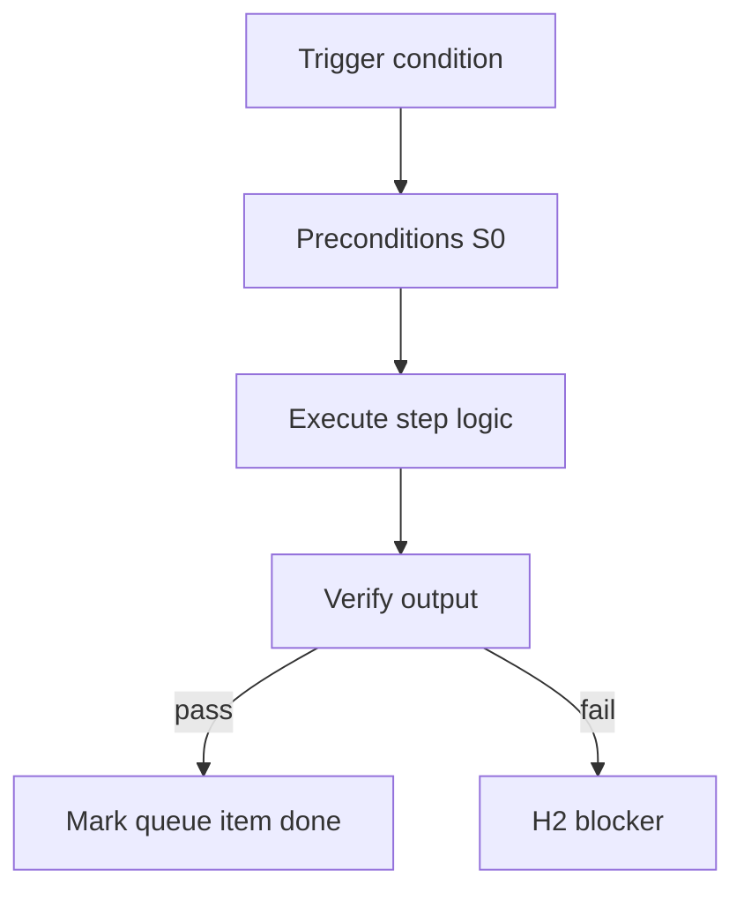

<!-- Complete pass 3 2026-06-28 SEC-17-6 -->

# SEC-17-6: Decision multi-goal single stack vs company_autopilot

**Parent:** — · **Branch SEC** · **Vision §17** · **Release:** meta

## Reader narrative
<!-- prose-source: agent meta 2026-06-28 -->

Open decision: single pursuit stack versus company_autopilot with prioritized multi-goal queue. Single stack simplifies state; multi-goal matches real companies running parallel initiatives.

state.goal nesting and parent_goal interact with whichever model is chosen. An ADR should specify preemption rules when two goals contend for the same active role.

## Purpose

SEC-17-6 defines decision multi goal single stack vs company autopilot for the agent-driven expert system. Roadmap, gap analysis, pursuit flow, decisions.
## Scope

- Owns `SEC-17-6` only; siblings under `—` must not duplicate this spec.
- Aligns with minimal HITL: H1 plan, H2 blocker, H3 sign-off ([INTRO-1.2](INTRO-1.2-human-touchpoint-contract-h1-h2-h3.md)).
- Conflicts resolve in favor of [Vision §17 — Open design decisions](../../full-automation-vision-and-hierarchy.md#17-open-design-decisions).

```
SEC-17-6 decision multi goal single stack vs company autopilot
```
## Behavior / step logic
<!-- timeline-source: agent cli-composer-2.5 2026-06-28 -->

1. After H1 approves a program milestone, program-scoper and integration-manifest-keeper produce the handoff manifest and artifact_graph with cross-stream dependencies and integration gates.
2. Before orchestrate-program spawns parallel lanes, the conductor reads the manifest and blocks lanes with missing, unverified, or stale upstream artifact_graph nodes.
3. When dependencies change, reconcile-artifact-graph marks nodes stale and pauses only blocked lanes until state.json shows cleared flags.
4. Each workstream records satisfied nodes and integration evidence under its lane lease ([C4.1](C4.1-workstreams-lane-json-leases.md)) for company-level goal_verify rollup.
5. If the manifest gate was never cleared, edges cycle, or a lane starts without satisfied upstream nodes, pursuit stops at H2.



## JSON example

```json
{
  "node": "SEC-17-6",
  "description": "decision multi goal single stack vs company autopilot",
  "state": { "ref": "APP-B-state-json-sketch.md" },
  "implemented_in_release": "v2.14+"
}
```


## Repo artifacts (this branch)


## Edge cases

- Operator closes laptop mid-loop — state.json must resume from last good dual-write.
- Concurrent manual edit to queue JSON — conductor reloads queue each wake; last writer wins with journal note.
- Edge case `SEC-17-6` variant 3: verify state dual-write before continuing pursuit.
- Edge case `SEC-17-6` variant 4: verify state dual-write before continuing pursuit.
- Pass 3: add regression test or evidence path specific to `SEC-17-6`.
- Pass 3: cross-link related nodes in same branch index.

## Failure modes

- **Silent stop:** Agent ends turn without updating queue → mitigated by /loop + check-hierarchy-queue.py EMPTY gate.
- **False complete:** Item marked done without artifact → audit-hierarchy-depth.py re-enqueues deepen pass.
- **Scope bleed:** Worker edits journal/state during planning-only expansion → forbidden in vision-expansion-prompt.
- **Stale design:** Upstream vision § changes → reconcile-stale adds deepen items for affected ids.

## Concrete implementation

1. Map `SEC-17-6` to v2.14–v2.23 release row in SEC-15-index.md.
2. Create or extend S0 script if behavior is file-derived.
3. Add unit test under tests/unit/test_sec-17-6.py when script exists.
4. Validate `SEC-17-6` against SEC-15 release checklist and parent index links.
5. Document `SEC-17-6` in parent index with verify command and release tag.
6. Add checklist row in SEC-15 release doc for `SEC-17-6`.

## Verification

| Check | Command |
|-------|---------|
| Completeness | `python scripts/automation/audit-hierarchy-depth.py --strict --ids SEC-17-6` |
| Conformance | `python scripts/validate-workflow.py` |
| Task evidence | `python scripts/verify-router.py` when implement task exists |

## Dependencies

| Link | Why |
|------|-----|
| [full-automation-vision-and-hierarchy.md](../../full-automation-vision-and-hierarchy.md) §17 | Master hierarchy |
| [—-index](—-index.md) | Parent grouping |
| [genius-conductor-tiered-routing.md](../../genius-conductor-tiered-routing.md) | S0–S4 routing |

## Acceptance criteria

- [ ] `python scripts/automation/audit-hierarchy-depth.py --strict --ids SEC-17-6` passes
- [ ] Named script, skill, or test path exists or is listed in SEC-15 release row
- [ ] Linked from [—-index](—-index.md)
- [ ] `python scripts/validate-workflow.py` passes after implement

## Cross-links

- [hierarchy-expander SKILL](../../../.cursor/skills/hierarchy-expander/SKILL.md)
