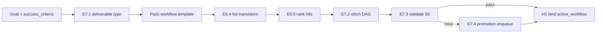

<!-- Complete pass 1 2026-06-28 SEC-18 -->

# SEC-18: Transistor model — A to Z reference

**Parent:** [SEC-index](SEC-index.md) · **Branch SEC** · **Vision §19** · **Release:** v2.24

## Reader narrative
<!-- prose-source: agent meta 2026-06-28 -->

This document is the **authoritative end-to-end model** for **transistors** and **generator workflows** in the AIDeveloper expert system. It resolves design questions from the 2026-06-28 transistor brainstorming lineage, extends the full-automation north star ([INTRO-0](INTRO-0-executive-summary---0.md), [INTRO-2](INTRO-2-transistor-building-blocks-north-star.md)), and defines how v2.24–v2.28 releases implement the fourth structural shift: **compose executable workflows before generating deliverables**.

v2.13–v2.23 reduced improvisation via compose-first catalog, S0 mandatory-first, and promotion ladder L0–L5—but still plans mostly in prose skills and picks one catalog component per turn. Transistors add typed I/O blocks wired into generator DAGs so agents compose before they invent, execute one verified node per turn, and promote misses to L6 on the platform queue. All E6, E7, B6, and C6 leaf specs must align with this reference.

See [Vision §19 — Transistor & generator workflow model](../../full-automation-vision-and-hierarchy.md#19-transistor--generator-workflow-model) for the hierarchy map and release rows in [SEC-15-index](SEC-15-index.md).

## Behavior / step logic
<!-- timeline-source: agent meta 2026-06-28 -->

1. Operators and implementers read SEC-18 once for terminology, schemas, and release order before opening E6–E7, B6, or C6 leaf specs.
2. Conductor and workflow-composer treat this document as authority when resolving transistor versus legacy compose-first conflicts.
3. Platform promotion to L6 and workflow-compose phases must conform to the schemas and acceptance checklist in sections D–Q.
4. v2.24–v2.28 release rows in section N map to implement tasks; leaf specs must not diverge without updating SEC-18 first.
5. Human H1 review may include the workflow DAG summary and transistor maturity targets from sections C and M.

## A. Architecture analogy (microprocessor model)

| Hardware | Expert system | Repo artifact |
|----------|---------------|---------------|
| Transistor | Atomic composable block | `docs/platform/transistors/<id>.json` |
| Logic gate | Gate transistor (pass/fail/retry/H2) | Gate node in workflow DAG |
| Standard cell | Reusable subgraph | `template-packs/_shared/workflows/*.json` |
| IC / chip | Generator workflow for one deliverable | `docs/workflows/<goal-id>.json` |
| Motherboard | Pursuit + catalog + platform queue | Planes A, D, E, H |
| Firmware | Template-pack company definition | `template-packs/*/company.yaml` |
| OS | Conductor + autopilot + state machine | v2 harness + [A2](A2-index.md) |

This extends—not replaces—the three-layer stack in [genius-conductor-tiered-routing.md](../../genius-conductor-tiered-routing.md): Genius orchestrates **workflow graphs**; economy workers execute **one transistor**; S0 scripts **validate wiring and verify nodes**.

---

## B. Terminology

| Term | Definition |
|------|------------|
| **Transistor** | Smallest reusable unit with machine-checkable **inputs**, **outputs**, **preconditions**, **executor**, and **verify**. |
| **Generator workflow** | Versioned DAG of transistor instances with labeled edges (including gate branches). |
| **Composer** | S3 skill ([B6.1](B6.1-workflow-composer-skill-s3-graph-planning.md)) that searches registry and stitches DAGs. |
| **Executor** | Runtime backend: `script`, `tool`, `soft_template`, or `gate`. |
| **Hard transistor** | Deterministic executor; zero LLM inside the block ([E6.3](E6.3-transistor-classes-hard-soft-gate.md)). |
| **Soft transistor** | Bounded LLM with output schema and token cap; S1 worker only. |
| **Gate transistor** | S0 predicate + DAG edge selection ([B6.4](B6.4-gate-transistor-pass-fail-edge-routing.md)). |
| **L6** | Promotion capstone: registered transistor ([D1.7](D1.7-l6-transistor-registered-composable-block.md)). |
| **L0 waiver** | Temporary unregistered node with journal rationale ([E7.4](E7.4-workflow-miss-enqueue-transistor-promotion.md)). |

---

## C. Design decisions (resolved)

| # | Question | Decision | Evidence / rationale |
|---|----------|----------|----------------------|
| 1 | Granularity | **One verify boundary per transistor** | [SEC-17-7](SEC-17-7-decision-transistor-granularity-one-verify-boundary.md); contains G5.1/G5.4 blast radius |
| 2 | Who composes | **workflow-composer S3 skill**; conductor approves | [SEC-17-8](SEC-17-8-decision-composer-s3-skill-not-conductor-inline.md); B3.1 thin turns, E4.3 read cap |
| 3 | Authoritative artifact | **JSON DAG required**; visual editor optional v2.28+ | [SEC-17-9](SEC-17-9-decision-json-dag-authoritative-visual-editor-optional.md); I2 SDK, J5 export |
| 4 | Library scope | **_shared global + pack overlay** | [SEC-17-10](SEC-17-10-decision-global--shared-transistors-plus-pack-overlay.md); F5.2/F5.3/G5.6 |
| 5 | New top-level plane? | **No Branch K**—extend B,C,D,E,F,G,H,I | Existing 242-leaf hierarchy; transistors unify E+C+D |
| 6 | vs L2 scripts | **L6 wraps L2**; script is executor implementation | D1.3 + D1.7; E6.5 ranking |
| 7 | vs skills | **Skills orchestrate phases**; transistors execute steps | D1.4 L3; skills become soft executor internals |
| 8 | Turns per node | **One workflow node per product turn** default | A2.2 parity; B6.3 |
| 9 | When mandatory | **workflow-compose before implement** for app/feature/milestone | C6.1 |
| 10 | Maturity target | **~70% hard, ~20% soft, ~10% gate** | E6.3; SEC-15-v2.28 metrics |

---

## D. Transistor manifest schema (v1)

**Path:** `docs/platform/schemas/transistor.v1.json`  
**Instances:** `docs/platform/transistors/<id>.json`

```json
{
  "id": "verify-router-invoke",
  "version": "1.0.0",
  "capability_id": "task.verify.pytest",
  "class": "hard",
  "maturity": "stable",
  "provenance": { "pack_id": "_shared", "promoted_from": null },
  "inputs": [
    { "name": "task_card_path", "type": "path", "required": true }
  ],
  "outputs": [
    { "name": "evidence_log", "type": "path", "required": true },
    { "name": "exit_code", "type": "integer", "required": true }
  ],
  "preconditions": [
    { "check": "file_exists", "path": "{{inputs.task_card_path}}" }
  ],
  "executor": {
    "kind": "script",
    "command": "python scripts/verify-router.py --task-card {{inputs.task_card_path}}"
  },
  "verify": {
    "kind": "exit_code",
    "expect": 0
  },
  "tags": ["sdlc", "verify", "s0"]
}
```

**Soft transistor** adds: `executor.prompt_template_path`, `executor.output_schema`, `executor.max_tokens`, `capability_class: S1`.

**Gate transistor** adds: `executor.kind: gate`, `executor.predicate_command` (S0 only); edges live in workflow JSON.

---

## E. Workflow DAG schema (v1)

**Path:** `docs/platform/schemas/workflow-dag.v1.json`  
**Instances:** `docs/workflows/<goal-id>.json`

```json
{
  "workflow_id": "wf-goal-001",
  "version": "1.0.0",
  "goal_id": "goal-001",
  "pack_id": "software-delivery",
  "template_ref": "template-packs/_shared/workflows/iterative-feature.json",
  "nodes": [
    {
      "id": "n1",
      "transistor_id": "task-breakdown-compose",
      "params": {},
      "retry_max": 1
    },
    {
      "id": "n2",
      "transistor_id": "scaffold-module",
      "params": { "module": "auth" },
      "retry_max": 2
    }
  ],
  "edges": [
    { "from": "n1", "to": "n2", "on": "pass" },
    { "from": "n2", "to": "n_verify", "on": "pass" },
    { "from": "n_verify", "to": "n3", "on": "pass" },
    { "from": "n_verify", "to": "n2", "on": "retry" },
    { "from": "n_verify", "to": "H2", "on": "fail" }
  ],
  "terminal_nodes": ["n_final"]
}
```

Validated by `validate-workflow-dag.py` ([E7.3](E7.3-validate-wiring-preconditions-postconditions-s0.md)).

---

## F. Composition protocol (extended E2)



**Ranking (extends [E2.3](E2.3-compose-rank-script-playbook-skill-facts.md)):**

`hard_transistor > script > soft_transistor > playbook > skill > facts`

Gate transistors are not ranked as capability substitutes—they implement control flow.

---

## G. Execution protocol (extended A2/C6)

1. Preflight ([A2.1](A2.1-preflight-check-pipeline-blocked-extended.md)) includes `active_workflow` validity ([H1.7](H1.7-state-active-workflow-block.md)).
2. If `next_action` is implement-related and C6.1 applies, require bound workflow.
3. Resolve `current_node_id` → transistor manifest.
4. Execute one node ([B6.3](B6.3-one-workflow-node-per-product-turn-default.md)):
   - **hard:** S0 or tool-operator ([I4.4](I4.4-transistor-executors-mcp-tool-script-boundary.md))
   - **soft:** bounded S1 worker + schema validate
   - **gate:** S0 predicate → edge select ([B6.4](B6.4-gate-transistor-pass-fail-edge-routing.md))
5. Run transistor `verify`; write evidence ([C3.3](C3.3-evidence-per-task.md)).
6. Advance `completed_nodes[]`; set next `current_node_id`.
7. On failure: [G6.4](G6.4-workflow-checkpoint-replay-from-failed-node.md) checkpoint + retry or H2.

---

## H. Persistence (`state.pursuit.active_workflow`)

Additive block ([H1.7](H1.7-state-active-workflow-block.md)):

```json
{
  "active_workflow": {
    "workflow_id": "wf-goal-001",
    "path": "docs/workflows/goal-001.json",
    "current_node_id": "n2",
    "completed_nodes": [
      { "node_id": "n1", "evidence": ["evidence/task-001-test.log"], "transistor_version": "1.0.0" }
    ],
    "failed_node_id": null,
    "retry_counts": { "n2": 0 },
    "branches": [],
    "validation_hash": "sha256:…",
    "terminal_nodes": ["n_final"]
  }
}
```

Platform block retains `promotion_queue` ([H1.3](H1.3-state-platform-block.md)); composition metrics optional in v2.28.

---

## I. Promotion ladder extension (L6)

Existing L0–L5 ([D1](D1-index.md)) unchanged. **L6 transistor** adds:

| From | Trigger | Platform work |
|------|---------|---------------|
| L0 repeat | Same capability 2× in workflows | [D4.7](D4.7-platform-work-transistor-extraction.md) |
| Compose miss | [E7.4](E7.4-workflow-miss-enqueue-transistor-promotion.md) | [D2.1.5](D2.1.5-enqueue-compose-miss-missing-transistor.md) |
| L2 script stable | Script + I/O known | Wrap as L6 hard transistor |
| Pack export | Domain pattern | [F1.9](F1.9-pack-transistors-and-generator-workflows.md) |

**Definition of done:** [D6.5](D6.5-platform-done-transistor-registry-and-graph.md) + [D6.1](D6.1-platform-done-catalog-index-row.md)–[D6.4](D6.4-platform-done-staleness-node-wired.md).

---

## J. Catalog integration (Plane E)

| Index | Path | Generator |
|-------|------|-----------|
| Transistors | `docs/platform/TRANSISTORS.md` | `regenerate-transistors-index.py` |
| Umbrella | `docs/platform/CATALOG.md` | includes E6 section ([E1.7](E1.7-catalog-platform-catalog-md-umbrella.md)) |
| Query | `list-transistors.py` | [E6.4](E6.4-list-transistors-query-io-compatibility.md) |
| Staleness | `docs/manifest/staleness.json` | [E5.4](E5.4-staleness-workflow-graph-transistor-nodes.md) |

Task card **Components used** lists `transistor_id` + manifest path ([C6.3](C6.3-task-card-binds-workflow-node-id.md), [E2.4](E2.4-compose-plan-task-card-components.md)).

---

## K. Pack integration (Plane F)

- [F1.9](F1.9-pack-transistors-and-generator-workflows.md): `workflows/`, `transistors/` in pack schema
- [F5.4](F5.4-shared-transistors-library-template-packs--shared.md): org-wide generic blocks
- Game studio ([F3](F3-index.md)): mesh-import, rig-humanoid, ue-validate transistors
- Data platform ([F4](F4-index.md)): ingest, dbt-run, deploy-check transistors

---

## L. Verification (Plane G)

| Control | Mistake class |
|---------|---------------|
| Per-node verify | G5.1 hallucinated done |
| workflow_node_id binding | G5.8 fuzzy chain |
| list-transistors dedupe | G5.6 duplicate tooling |
| goal_verify rollup | [G2.5](G2.5-per-node-evidence-rollup-goal-verify.md) |
| Checkpoint replay | [G6.4](G6.4-workflow-checkpoint-replay-from-failed-node.md) |

---

## M. Bootstrap transistor set (v2.24)

Ship with registry foundation ([SEC-15-v2.24](SEC-15-v2.24-release-v2-24-transistor-schema-registry-list-transistors.md)):

| id | class | wraps |
|----|-------|-------|
| `route-tier-preflight` | hard | `scripts/route-tier.py` |
| `check-pipeline-blocked` | hard | `scripts/automation/check-pipeline-blocked.py` |
| `validate-workflow-run` | hard | `scripts/validate-workflow.py` |
| `verify-router-invoke` | hard | `scripts/verify-router.py` |
| `dual-write-journal-state` | hard | journal-keeper contract |
| `list-components-query` | hard | future `list-components.py` |
| `list-transistors-query` | hard | `list-transistors.py` |

---

## N. Release sequence (v2.24–v2.28)

| Release | Deliverable | Depends on |
|---------|-------------|------------|
| [v2.24](SEC-15-v2.24-release-v2-24-transistor-schema-registry-list-transistors.md) | Schema, bootstrap transistors, list-transistors | v2.17 catalog |
| [v2.25](SEC-15-v2.25-release-v2-25-workflow-dag-validate-workflow-dag.md) | workflow-dag schema, validate-workflow-dag, C6.1 | v2.24 |
| [v2.26](SEC-15-v2.26-release-v2-26-workflow-composer-active-workflow-execution.md) | composer skill, active_workflow, execution | v2.25 |
| [v2.27](SEC-15-v2.27-release-v2-27-pack-workflow-templates-cross-domain.md) | pack templates, parallel branches | v2.26, v2.22 _shared |
| [v2.28](SEC-15-v2.28-release-v2-28-transistor-maturity-dashboard-metrics.md) | dashboard metrics, optional DAG viewer | v2.27 |

Update [plans/v2-full-evolution.md](../v2-full-evolution.md) after v2.23 row.

---

## O. End-to-end example (software feature)

**Goal:** Add auth module to existing API.

1. H1 approves goal + success_criteria (JWT tests pass).
2. workflow-compose loads `iterative-feature` template ([E7.1](E7.1-resolve-deliverable-type-workflow-template.md)).
3. Composer stitches: `spec-gap-analysis` → `dd-slice-auth` → `scaffold-fastapi-module` → `implement-task-card` → `verify-router-invoke` → gate → `git-commit-branch`.
4. validate-workflow-dag.py pass → active_workflow bound.
5. Pursuit executes one node per turn; each node evidence logged.
6. Terminal node reached → G2.5 rollup → goal_verify → H3.

Missing `scaffold-fastapi-module` → E7.4 enqueue → platform turn mints L6 → workflow patched (E5.4 stale bump).

---

## P. End-to-end example (game asset)

**Goal:** Rig humanoid for UE import (game studio pack).

1. Template: `concept → mesh-cleanup → rig-humanoid → skin-test → ue-import → perf-gate`.
2. Tool transistors: Blender MCP, UE CLI ([I4.4](I4.4-transistor-executors-mcp-tool-script-boundary.md)).
3. Gate: deformation test pass/fail ([B6.4](B6.4-gate-transistor-pass-fail-edge-routing.md)).
4. goal_verify: asset in engine + perf budget ([F3.4](F3.4-game-studio-goal-verify-asset-engine-tests-perf.md)).

---

## Q. Acceptance checklist (program complete)

- [ ] `docs/platform/schemas/transistor.v1.json` and `workflow-dag.v1.json` in repo
- [ ] Bootstrap transistors registered with tests
- [ ] `list-transistors.py` and `validate-workflow-dag.py` in CI
- [ ] workflow-composer skill operational
- [ ] `state.pursuit.active_workflow` in validate-workflow.py schema
- [ ] C6.1 enforced in greenfield + iterative pipelines
- [ ] _shared + one domain pack ship workflow templates
- [ ] SEC-14 gap row "Transistor workflows" marked bridged
- [ ] Dashboard transistor metrics (v2.28)

---

## Cross-links

- [INTRO-2-transistor-building-blocks-north-star](INTRO-2-transistor-building-blocks-north-star.md)
- [full-automation-vision-and-hierarchy.md](../../full-automation-vision-and-hierarchy.md) §19
- [genius-conductor-tiered-routing.md](../../genius-conductor-tiered-routing.md)
- Leaf index: [E6-index](E6-index.md), [E7-index](E7-index.md), [B6-index](B6-index.md), [C6-index](C6-index.md)
